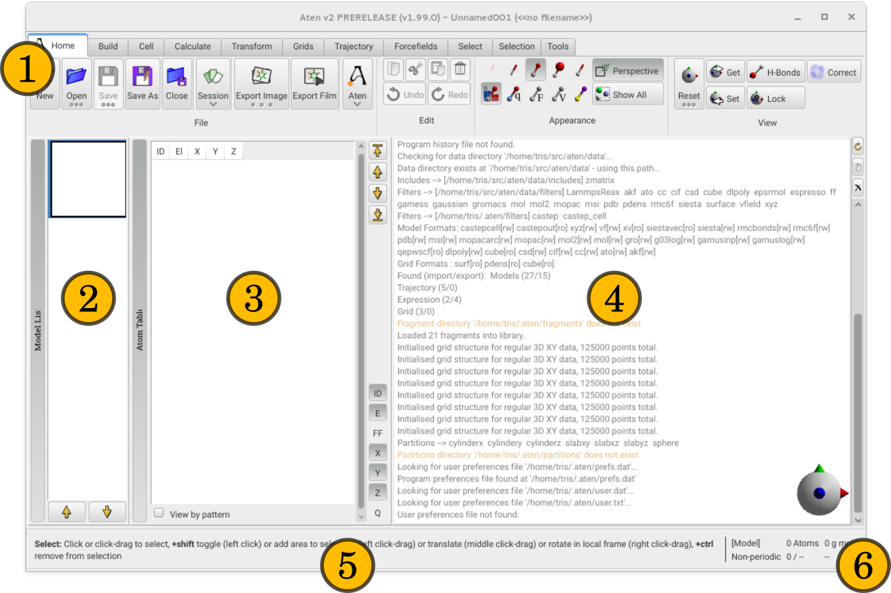

The main window of **Aten** (in version 2.0) mimicks the 'ribbon' style toolbar (**1**) of popular office-related software. Much of the primary focus of the main window is on the model viewing canvas (**4**) which also doubles as a message display area.

{.imgfull}

## Toolbar (1) 

All of **Aten**'s core functionality, tools, and actions are encapsulated in the toolbar at the top of the main window (**1**). Each set of tools is grouped by a specific panel, and within that panel further separated and grouped by specific functionality. Each panel and the tools it contains is described in detail in the forthcoming sections.

Some buttons on the toolbar have associated drop-down 'popups' (bit of a contradiction in terms, but never mind) - those buttons with a downward arrow at the bottom serve no purpose other than to raise their associated popup immediately when clicked (e.g. the **Session** button on [**Home**](/aten/docs/gui/home)&#8594;[**File**](/aten/docs/gui/home#file)), while those with an ellipsis at the bottom (&#149;&#149;&#149;) have both a function of their own (if clicked once) and a popup menu (if long-pressed).

## Model List (2) 

All model's currently loaded in are displayed in the **Model List** (**2**) as miniature icons of their contents. Selecting a model here will make it the current model, and the primary focus of the main view (**4**). Multiple models can be selected at once using `Shift` and/or `Alt` in combination with the left mouse button, in which case all are displayed in the main view in a grid layout. Only one model is ever the current model, however, and the target of all editing operations. The **Model List** can be shown and hidden by clicking the associated large vertical button, and its default state on startup can be set with the **Store State** button in the **Aten** submenu of the [**Home** panel](/aten/docs/gui/home#file).

## Atom List (3) 

For the current model, the **Atom List** (**3**) provides details on every atom present within it, showing coordinates, element information etc. The item selection in the **Atom List** also directly reflects the atom selection in the model, and thus the target of many editing operations (e.g. cut, paste, translate, etc.). Similarly, changing the atom selection via interaction with the model in the Main View (**4**) alters the selection state of items in the **Atom List**. As with the **Model List**, the **Atom List** can be shown and hidden by clicking the associated large vertical button, and its default state on startup can be set with the **Store State** button in the **Aten** submenu of the [**Home** panel](/aten/docs/gui/home#file).

Exactly what information is shown for each atom is controlled with the various toggle buttons at the bottom-right of the list. In descending order, they represent the integer atom index (ID), element (E), assigned forcefield atom type (FF), coordinates (X, Y, Z), and assigned charge (Q). If patterns have been defined for the model, and the **View by pattern** checkbox at the bottom of the list is enabled, the atoms in the list will be grouped according to their encompassing pattern, otherwise they are listed in one continuous run by ascending ID. If patterns **are** defined, (de)selecting the pattern name in the list (de)selects all atoms making up the pattern in the model.

The **Atom List** also allows atoms to reordered with the four arrow buttons at the top right of the list. These operations affect the current atom selection, shifting the atoms to the start of the list, up one place in the list (to lower indices), down one place in the list (to higher indices), and to the end of the list respectively. In the case of shifting multiple atoms to the beginning / end of the list, the relative order of atoms is preserved.

## Main View (4) 

The Main View (**4**) is where the current model(s) is (are) displayed - exactly which of the currently-loaded models are displayed is controlled by the selection in the **Model List** (**2**). If multiple models are displayed simultaneously, the current model (the target of all editing operations) is indicated with a 'halo' in the background of the model view. The **Main View** also shows all messaging output - by default this is displayed in the background, behind all model views. The space bar cycles the visibility of model views and the messages, changing whether one is drawn on top of the other, or one is omitted completely. The message buffer itself can be cleared, copied, and scrolled with the controls on the far right of the **Main View**.

See the next section on [interaction](/aten/docs/gui/interaction) for a description of mouse button actions etc.

## Statusbar (5) 

For the currently selected interaction tool usage information is displayed in the **Statusbar** (**5**), along with the effects of modifier keys (if any).

## Infobar (6) 

The **Infobar** (**6**) displays some useful information on the current model, grouped into three columns and two rows as follows:

| | | |
|----------------|--------|---------|
| Rendering Source | Number of atoms in model | Molar mass |
| Unit cell type | Number of selected atoms and empirical formula | Density (if periodic) |

The Rendering Source is one of the following:
+ [Model] : indicates that that the rendering source is a model with no trajectory
+ [Parent of N] : indicates that the rendering source is a model that is parent to N trajectory frames
+ [Frame N of M] : indicates that the rendering source is frame N of the trajectory
