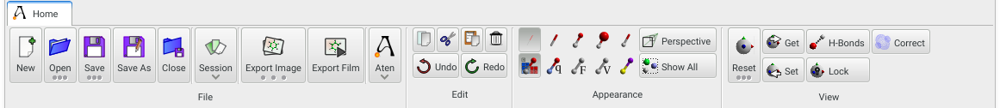
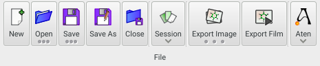
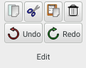
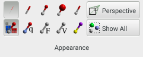
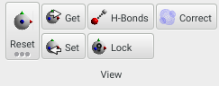

The **Home** panel contains all common tasks such as model loading / saving, image export, basic editing functions, and controls to change the general view appearance and camera position.

{.imgfull}

## File Group 

{.imgfull}

### New

_Shortcut: Ctrl-N_

Create a new, empty model

### Open

_Shortcut: Ctrl-O_

Load an existing model from disk.  Long-pressing shows the recent files menu.

### Save

_Shortcut: Ctrl-S_

Saves the current model, overwriting its existing file.  Long-pressing allows access to any filter **Options** that are available for the current file save format.

### Save As

_Shortcut: Ctrl-Shift-S_

Saves the current model under a different filename.

### Close

_Shortcut: Ctrl-W_

Closes the current model, saving any changes first to the existing file (or, optionally, a new file if no there is no existing filename).

### Session

The **Session** button allows access to Session control, loading and saving.  A 'session' represents all the data currently loaded and displayed in **Aten**, including models, forcefields, grids etc.  **Clear**ing the session will remove all loaded data, and return **Aten** to a state resembling a fresh start-up. Session files (`*.asf`) can be **Load**ed and **Save**d to allow quick return to a set of seecific models, views etc. See the topic on [Sessions](/aten/docs/topics/sessions) for a more in-depth description of the data contained in a session, and exactly what is saved in `asf` files.

### Export Image

Allows export of the current (potentially multiple-model) view to an image of arbitrary size. Long-pressing allows the current view to be copied to the clipboard - the resulting image will have dimensions corresponding to those of the **Main View**.

### Export Film

Raises the [**Export Film**](/aten/docs/gui/exportfilm) dialog, allowing a movie of the current model and/or its trajectory to be saved. See the [**Export Film**](/aten/docs/gui/exportfilm) section for more information.

### Aten

The **Aten** button provides access to various program-related functions / options, including the main program [**Preferences**](/aten/docs/gui/prefs). Here it is also possible to store the default size and position of the main window, along with the visibility of the [**Model List**](/aten/docs/gui/mainwindow#modellist) and [**Atom List**](/aten/docs/gui/mainwindow#atomlist).

## Edit Group 

{.imgfull}

### Cut

_Shortcut: Ctrl-X_

Copy and remove the current atom selection

### Copy

_Shortcut: Ctrl-C_

Copy the current atom selection

### Paste

_Shortcut: Ctrl-V_

Paste the last copied atom selection at their original coordinates

### Delete

_Shortcut: Ctrl-Delete_

Delete the current atom selection

### Undo

_Shortcut: Ctrl-Z_

Undo the last performed action

### Redo

_Shortcut: Ctrl-Shift-Z_

Redo the last performed action

## Appearance Group 

{.imgfull}

### Drawing Style

_Shortcut: F1 - F5_

The top row of five [Drawing Style](/aten/docs/enums/drawstyle) icons affects the global appearance of all models, showing them as (left to right) 'stick', 'tube', 'sphere', 'scaled sphere', and 'individual' styles. The latter renders each atom according to its locally-set style (which defaults to 'stick') and which can be modified through the [**Selection** panel](/aten/docs/gui/selection).

### Colour Scheme

_Shortcut: Ctrl-F1 - Ctrl-F5_

While the top row of five icons affects drawing style, the bottom row affects the atom [Colour Scheme](/aten/docs/enums/colourscheme) used.  Left to right these are: 'element', 'charge', 'force', 'velocity', and 'custom'. The 'element' style colours atoms according to the colours set for elements in the Preferences, while the 'charge', 'force', and 'velocity' options colour according to the relevant atomic property and the associated [Colourscale](/aten/docs/topics/colourscales) in the Preferences. The final option, 'custom', colours each atom according to its locally-set colour, which defaults to that corresponding to its element, but which may be changed through the [**Selection** panel](/aten/docs/gui/selection).

### Perspective

Toggles between perspective and orthographic displays for all models

### Show All

_Shortcut: Ctrl-Shift-H_

Un-hides any previously-hidden atoms in the current model.

## View Group 

{.imgfull}

### Reset

_Shortcut: Ctrl-R_

Resets the view of the current model to the default, looking straight along negative-Z, with X left-to-right and Y bottom-to-top. Long-pressing shows additional view orientations along cartesian and cell axes that may be set.

### Get / Set

Copies (**Get**) and applies (**Set**) the view from / to the current model, and can be used to apply specific view orientations from one model to another.

### H-Bonds

_Shortcut: F8_

Toggles detection and display of hydrogen bond-type interactions. The appearance of the H-bond 'dots' can be changed in the [**Preferences** window](/aten/docs/gui/prefs).

### Lock

Each model has its own independent view, unless the **Lock** button is enabled in which case all models will share the same view matrix - changing the view in one model will be immediately reflected in the views of all others.

### Correct

When displaying transparent surfaces of gridded data it is likely that rendering artefacts in the surface will appear since the transparent triangles which make up the surface will be drawn in the wrong order (i.e. not back-to-front). Enabling the **Correct** option will regenerate the grid surface at the end of every view manipulation, correcting for the view rotation and removing transparency artefacts.
