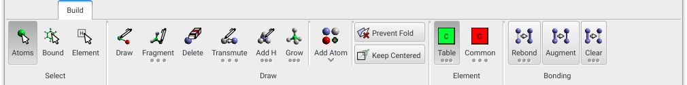
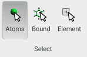
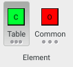
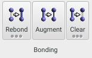

The **Build** panel provides basic selection and drawing tools, and bond calculation / augmentation methods.

{.imgfull}

## Select Group 

{.imgfull}

### Atoms

_Shortcut: Escape_

The primary selection mode (and the mode that **Aten** sits in when simply visualising), this allows individual atoms to be clicked or a selection-box to be drawn around multiple atoms in order to select them. With the **Shift** key pressed the selection state of the atoms is toggled, and if **Ctrl** is held down the atoms are removed from the current selection.

### Bound

Select individual bound fragments - clicking on any atom in a molecule will select the entire molecule by performing a recursive tree-select from that atom. With the **Shift** key pressed the selection state of the fragment is toggled, and if **Ctrl** is held down the fragment is removed from the current selection.

### Element

Select all elements of the same type as the clicked atom. Again, holding **Shift** toggles the selection while holding **Ctrl** removes them from the selection.

## Draw Group 

{.imgfull}

### Draw

Sketch individual atoms and bonds with the **Draw** tool. New atoms are created as the currently-selected [**Element**](/aten/docs/gui/build#element).

### Fragment

Draw molecular fragments, and append molecular fragments to existing atoms. Long-pressing the **Fragment** button shows the fragment selection popup, from which the available drawing fragments can be browsed and one selected for drawing.

In this mode a copy of the selected fragment is 'attached' to the mouse cursor and can be drawn in any desired position, but will snap to existing atoms that possess an available binding site (according to their current bond involvement). When snapped, holding **Shift** will replace the clicked atom rather than creating a new bond between it and the attachment point (TODO Check this!). **Ctrl** ??? Finally, **Alt** cycles over the possible attachment points on the fragment.

To define new fragments, see the section on [defining fragments](/aten/docs/user/fragments).

### Delete

Operates in a similar way to the **Draw** tool, except that clicking on an atom deletes it, and click-dragging over a bond deletes it.

### Transmute

Clicking on individual atoms transmutes them into the current [**Element**](/aten/docs/gui/build#element). Long-pressing exposes an option to transmute all atoms in the current selection.

### Add H

Clicking on individual atoms adds on hydrogen atoms until the basic bond order requirements of the atom are satisfied. The algorithm attempts to find the best geometry for the new hydrogens as it can. Long-pressing exposes options to add hydrogens to all atoms in the current selection, or all atoms in the current model.

### Grow

The **Grow** tool allows individual atoms of the current [**Element**](/aten/docs/gui/build#element) to be added ('grown') to clicked atoms. Long-pressing allows selection of the desired geometry in which atoms should be added, along with control over the distance of added atoms (either **Use van der Waals Radii** or a set **Fixed Distance**). There also exists the option of growing an atom, in the specified geometry, onto each atom in the current selection.

### Prevent Fold

When transforming atoms in a periodic system with the mouse (i.e. rotating or translating them) if any move outside the unit cell as a result of the transformation they are automatically folded back in to the confines of the cell. If **Prevent Fold** is enabled these folding operations will not occur.

### Keep Centered

If the **Keep Centred** option is enabled, any editing operation will trigger a 're-centering' of the current model, so that the centre-of-geometry of the model being edited is always at the origin. This can be useful when editing non-periodic models, and keeps everything nice and centered on the screen.

## Element Group 

{.imgfull}

### Table

The **Table** button allows specification of the element for newly-created atoms by selection from the periodic table (by long-pressing). **Table** is mutually-exclusive with **Common**.

### Common

The **Common** button allows specification of the element for newly-created atoms from a pre-defined list of 'common' elements, and can be configured as necessary through the [Preferences](/aten/docs/gui/prefs). **Common** is mutually-exclusive with **Table**.

## Bonding Group 

{.imgfull}

### Rebond

Recalculates all bonds in the current model, determining whether two atoms are bound from the relative, scaled radii of the atoms involved. The default mode (single-click) is to determine connectivity between atoms and then perform a subsequent augmentation of the detected bonds (i.e. attempt to resolve multiple bonds, aromaticity etc.). See the topic on [bonding](/aten/docs/topics/bonding) for a description of how these algorithms operate. Long-pressing exposes options for recalculation of bonds without augmentation, and for restricting the recalculation to the current selection or to make use of the current pattern definition. The tolerance of the algorithm may also be adjusted - a higher tolerance means more bonds will be detected, but may potentially detect unwanted connections.

### Augment

Applies the [augmentation algorithm](/aten/docs/topics/bonding#augmentation) to the current model, keeping the current connectivity as-is.

### Clear

Removes all bonds from the current model. Long-pressing exposes options to remove bonds only from the current selection.

