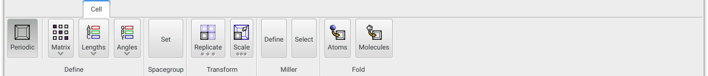
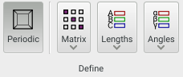
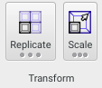
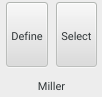
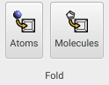

The **Cell* panel allows unit cell definitions to be created and removed, cell contents to be transformed, and packing of atoms (according to crystallographic spacegroups) to be performed.

{.imgfull}

## Define Group 

{.imgfull}

### Periodic

If enabled, the current model possesses a unit cell of some description (can be used to toggle the model's unit cell on and off without loss of information).

### Matrix

Allows editing of the individual components of the current unit cell matrix. **Lengths** and **Angles** are updated automatically.

### Lengths

Allows the A, B, and C lengths of the cell to be set, keeping the angles constant. The cell **Matrix** is updated automatically.

### Angles

Allows the alpha, beta, and gamma angles of the cell to be set, keeping the lengths consstant. The cell **Matrix** is updated automatically.

## Spacegroup Group 

{.imgfull}

### Set

XXX TODO

## Transform Group 

{.imgfull}

### Replicate

Allows the current cell to be replicated along its three principal axes in both positive and negative directions. Long-pressing exposes the controls that control the extent of replication - the six inputs represent negative and positive replication values for each direction – most of the time its probably only useful to consider the positive (right-most) replication directions. Note that the numbers define the number of (fractional) cells to be created relative to the original. Thus, if all negative directions are zero, and all positive directions are one, the original cell will remain untouched. Entering a value of 2 for each positive direction will give a 2×2×2 supercell of the original cell, and so on.

Atoms in the model are folded into the unit cell prior to replication, unless the **Fold Before** checkbox is unticked. Similarly, atoms that exist outside of the cell after replication are trimmed unless the **Trim After** checkbox is unchecked.

### Scale

Allows the principal axes of the current unit cell to be arbitrarily scaled, along with the cell's contents. Long-pressing gives access to the scaling amounts in each direction. The default behaviour is to scale the position of each atom independently of the fragment in which it exists. If **Scale molecule COG** is enabled then the centre-of-geometry of each distinct molecular fragment is scaled instead, with all intramolecular disntaces within the fragment remaining constant.

## Miller Group 

{.imgfull}

### Define

Permits the definition of a Miller plane from its h, k, and l indices, ready for **Selection**.

### Select

Selects atoms according to the defined Miller plane. The selection of atoms can be done in one of two ways, removing either those atoms that are ‘inside’ or those atoms that are ‘outside’ of the defined Miller plane and its periodic or symmetric equivalent.

## Fold Group 

{.imgfull}

### Atoms

Performs periodic boundary condition calculation on all individual atoms in the current model, ensuring that they are within the confines of the defined unit cell.

### Molecules

Performs periodic boundary condition calculation on the centres of geometry of all molecular fragments in the current model, ensuring that they are within the confines of the defined unit cell. The result is that all molecular centres will be inside the defined unit cell, and all molecular fragments will be 'intact', but not all atoms will necessarily be present inside the unit cell.
