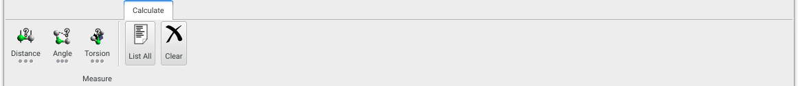
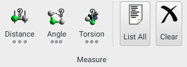

Tools to calculate simple properties, such as geometry, for models

{.imgfull}

## Measure Group 

{.imgfull}

### Distance

Measure distances between atoms by clicking on each atom in sequence. The corresponding atom IDs and distance are printed to the messages, and a geometry label created in the model. If the model is periodic and minimum image calculation is necessary then both the minimum image distance and 'literal' coordinate distances are printed). Long-pressing exposes options to calculate bound distances between all atoms in the current selection.

### Angle

Measure angles between atoms by clicking on each atom of the angle in sequence. The corresponding atom IDs and angle are printed to the messages, and a geometry label created in the model. Long-pressing exposes options to calculate bound angles between all atoms in the current selection.

### Torsion

Measure torsion angles between atoms by clicking on each atom of the torsion in sequence. The corresponding atom IDs and angle are printed to the messages, and a geometry label created in the model. Long-pressing exposes options to calculate torsion angles between all atoms in the current selection.

### List All

Lists all the measurements in the current model, printing them to the [**Messages**](/aten/docs/gui/mainwindow#mainview) display.

### Clear

Clear all measurements in the current model
