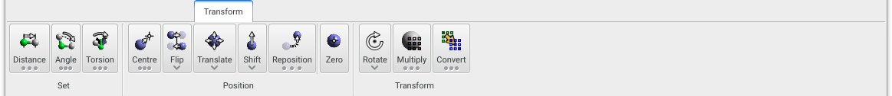
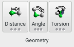
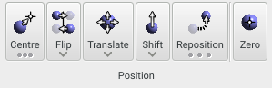

Provides tools to set explicitly the positions of atoms _en masse_ and relative to eath other, and to perform matrix-type transformations of atom selections.

{.imgfull}

## Geometry Group 

{.imgfull}

The three tools here allow adjustment of intramolecular bond, angle, and torsion values - note that atoms attached to the target bond, angle, or torsion are translated / rotated along with those in the selected intramolecular feature.

### Distance

Set all bond distances in the current atom selection to a specific value. Long-pressing exposes options for setting the desired distance, for nudging bond distances by a specified amount, and for controlling which end of the bond is moved. This last option can be set so that the lowest/highest of the two atom IDs is moved, or the lightest/heaviest of the two atoms is moved, or both atoms are moved equally in opposite directions.

### Angle

Set all bond angles in the current atom selection to specific value. Long-pressing exposes options for setting the desired angle, for nudging bond angles by a specified amount, and for controlling which end of the angle is moved (the 'knuckle' atom _j_ always remains in the same place). This last option can be set so that the lowest/highest of the two atom IDs is moved, or the lightest/heaviest of the two atoms is moved, or both atoms are moved equally in opposite directions.

### Torsion

Set all torsion angles in the current atom selection to specific value. Long-pressing exposes options for setting the desired angle, for nudging torsion angles by a specified amount, and for controlling which end of the torsion is moved (the two central atoms of the torsion, _j_ and _k_, always remains in the same place). This last option can be set so that the lowest/highest of the two atom IDs is moved, or the lightest/heaviest of the two atoms is moved, or both atoms are moved equally in opposite directions.

## Position Group 

{.imgfull}

### Centre

Shift the current atom selection so that the geometric centre is at a specific coordinate. Long-pressing exposes options for setting the desired centre coordinate, to prevent (lock) movement in certain Cartesian directions, and to define the target centre coordinate from the geometric centre of the current atom selection.

### Flip

Invert the X, Y, or Z coordinates of the current atom selection about its centre of geometry.

### Translate

Shifts the current atom selection a specified amount along the axes of one of three frames of reference:
+ **Model**: The frame of reference is the model frame, i.e. the Cartesian X, Y, and Z directions.
+ **World**: The frame of reference is the view plane, with X running left-to-right, Y running top-to-bottom, and Z running front-to-back. Translating in this frame effectively ignores the rotation of the model.
+ **Cell**: The frame of reference is the cell axes definition, i.e. A, B, and C. Note that, in this frame of reference, the **Shift** amount represents a fractional amount along the target cell axis.

### Shift

Move atoms forward / backward along a specified vector. The vector itself can be entered manually or **Pick**ed by clicking on two atoms in the model. The magnitude of the defined vector, in combination with the **Shift** multiplier, defines the distance by which the atom selection will be shifted along the vector.

### Reposition

Repositions the current atom selection so that a target coordinate R1 is shifted to become R2. Long-pressing exposes controls to set the R1 and R2 coordinates, and to define them from current atom selections. In many respects this tool is similar to the **Shift** tool, but works in literal coordinate terms instead.

### Zero

_Shortcut: Ctrl-0_

Centres the current atom selection at {0,0,0}.

## Transform Group 

{.imgfull}

### Rotate

The **Rotate** tool allows an origin and a rotation axis about this origin to be defined about which to rotate the current atom selection. The origin and axis may be entered manually, can be **Define**d from the current atom selection, or **Pick**ed by the click-selection of two atoms.  Defining the rotation axis from the current selection will set the axis to the vector between the currently-defined origin and the centre of geometry of the current atom selection. Rotations of atom selections about this axis/origin combination are then made by defining the **Angle** of rotation (in degrees) and then applying the rotation either clockwise or anticlockwise.

### Multiply

Apply a 3x3 transformation matrix to the current atom selection, and with a specific coordinate origin (not necessarily the centre of geometry of the selection). The **Pick** buttons allow selection of the various axes through click-selection of two atoms (not necessarily in the same model as the current atom selection), while the **Normalise** buttons will normalise each of the currently-defined axes to be of unit length. Finally, the **Orthogonalise** and **Generate** buttons allow particular axes to be orthogonalised relative to, or generated from, the other defined axes.

### Convert

Transform the current atom selection so that a frame of reference M1 is transformed into a frame of reference M2. The **Source** matrix defines what should be considered as the current frame of reference for the coordinates. Once the **Convert** button is pressed, a rotation matrix is generated such that, when multiplied with the **Source** matrix it will be transformed into the **Target** matrix.

Each axis of the **Source** and **Target** matrices may be entered manuall or **Pick**ed from click-selection of two atoms, and normalised, orthogonalised, or generated (from the cross-product of the other two defined axes) from the associated controls.

