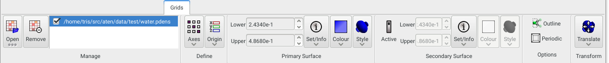
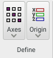
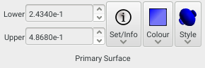
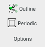
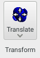

The **Grids** panel provides management for grid data owned by the current model, and allows their definition and appearance to be defined.

{.imgfull}

## Manage Group 

{.imgfull}

All grids owned by the current model are listed here - each has a checkbox determining the visibility of any surfaces set for the data. The entry selected in this list reflects the current grid, and the target of all other controls on the panel.

### Open

Open and associate a new grid file with the current model. Long-pressing reveals the recent grids list.

### Remove

Remove the selected grid in the list from the current model.

## Define Group 

{.imgfull}

### Axes

Allows definition of the set of axes determining the effective shape of individual grid elements

### Origin

Allows setting of the coordinate origin of the grid data

## Primary / Secondary Surface Groups 

{.imgfull}
{.imgfull}

For each grid associated with a model up to two surfaces may be calculated and drawn - these are the **Primary** and **Secondary** surfaces. There is no physical difference between how the data is treated in each case.

### Lower / Upper

For 3D gridded (voxel) data, the **Lower** and **Upper** cutoffs determine exactly which surface is constructed and drawn from the data. Typically, the **Upper** cutoff is set to the maximum value found in the data, while the **Lower** represents the minimum 'visible' value that is desired, resulting in a surface that encompasses all values above the **Lower** cutoff.  Of course, reducing the **Upper** cutoff allows a slice of some 'range' of grid values to be displayed, whatever the meaning of such a thing might be.

### Set / Info

Some basic information about the selected grid is shown in **Set/Info**, including the number of points, minimum and maximum data values found over all points, and the sums of positive- and negatively-valued elements over the grid. Furthermore it provides some tools for setting the **Lower** cutoff based on some multiple of a (user-defined) number density, or to set it so that a certain percentage of the total value in the grid is shown.  Note that this last option employs a 'best-effort' algorithm to find the requested percentage, and will not always be able to exactly match what is asked for.

### Colour

Sets the colour of the surface, including its transparency.  If a semi-transparent surface is desired then you may observe rendering artefacts from certain view angles since there is no on-the-fly sorting algorithm presently implemented in Aten. Instead, enable the **Correct** option on the [**View Group**](/aten/docs/gui/home#view) on the [**Home Panel**](/aten/docs/gui/home) which achieves the same effect by reconstructing the surface when necessary.

### Style

Allows the basic view style of the surface to be changed, from points to a triangular mesh to a full (solid) surface.

## Options Group 

{.imgfull}

### Outline

Draws a box around the extreme limits of the grid data (according to the number of points in each axis direction, the voxel axes, and the grid origin).

## Transform Group 

{.imgfull}

### Translate

Allows the grid data to be effectively shifted inside its bounding box volume, wrapping points which cross edges. Occasionally calculated grid data will be in 'undesirable' positions (this is particularly true in the case of orbitals generated in periodic DFT codes) and it is necessary to translate them in order to 'make whole' the parts of interest.

To translate the grid data (and, optionally, all atoms in the model or just the current selection) either use the arrow controls to translate by single grid voxels in each direction, or set the absolute number of points in the spin boxes at the foot of thie popup.

