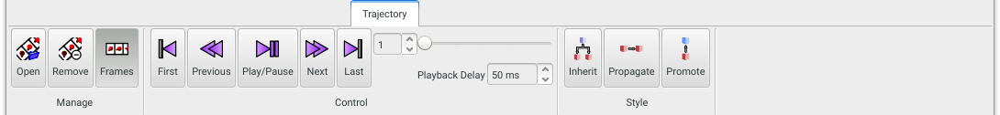
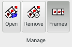
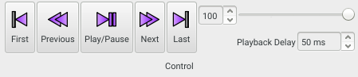
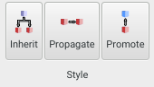

If a model has an associated trajectory, or you want to associated a trajectory to it, the **Trajectory** panel is your friend. A trajectory cannot exist on its own in **Aten** - it must always be associated with a 'parent' model. This parent model does not necessarily reflect the contents of the trajectory frames, and may be empty provided that the [trajectory import filter](/aten/docs/filters/trajectories) does not rely on parent model content in order to process the trajectory frames in the file.

{.imgfull}

## Manage Group 

{.imgfull}

### Open

Open and associated (or replace) a trajectory with the current model

### Remove

Remove any trajectory associated with the current model

### Frames

This toggle determines whether the parent model or the trajectory itself is shown in the [**Main View**](/aten/docs/gui/mainwindow#mainview).

## Control Group 

{.imgfull}

A set of standard playback controls allow individual frames to be skipped, as well as going straight to the beginning or end of the trajectory. The current frame may also be set with either the spin control or associated slider. The **Playback Delay** determines the delay, in milliseconds, between the display of subsequent frames in playback (but is, of course, limited by the time it takes to render the model contents each time).

## Style Group 

{.imgfull}

### Inherit

If the content of the parent model is indicative of the trajectory frame content (i.e. the ordering, number, and type of atoms is the same in each) then the **Inherit** button will copy style information (drawing style, assigned colour etc.) from the parent model to each of the trajectory frames. In this way a style 'template' can be setup on the parent model and applied easily to all frames.

### Propagate

Copies the style (drawing style, assigned colour etc.) of the atoms in the current trajectory frame to all frames following it.

### Promote

Copies the style (drawing style, assigned colour etc.) of the atoms in the current trajectory frame up to the parent model.

