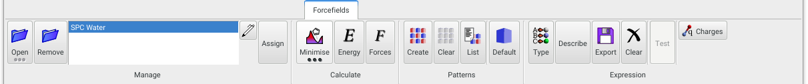
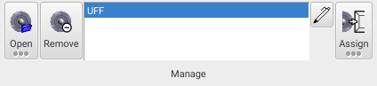
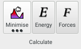
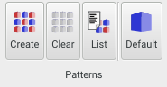
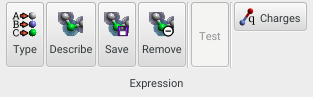

The **Forcefields** panel handles the management of forcefield files, creation of [Patterns](/aten/docs/topics/patterns), and generation of energy expressions, and also provides tools for the geometry minimisation of models.

{.imgfull}

## Manage Group 

{.imgfull}

All forcefields currently loaded in **Aten** are listed here. The selected item in the list indicates the current forcefield.

### Open

Load an existing forcefield into **Aten**. Long-pressing reveals the recent files list.

### Remove

Remove the current forcefield, disassociating it from any models.

### Edit

Allows editing of the current forcefield in the [**Forcefield Editor**](/aten/docs/gui/ffeditor).

### Assign

Assigns the current forcefield to the current model, meaning that it will be used in forcefield-related tasks in preference to any other loaded forcefields.

## Calculate Group 

{.imgfull}

### Minimise

Perform energy minimisation (with respect to geometry) on the current model using the currently-selected algorithm. Long-pressing exposes minimisation options, including choice of algorithm to employ and the related convergence criteria.

### Energy

Calculate and print a decomposition of the energy of the current model.

### Forces

Calculate the forces of the atoms in the current model.

## Patterns Group 

{.imgfull}

### Create

Automatically create a [pattern](/aten/docs/topics/patterns) definition for the current model, determining basic molecular species in the model and their repeat count.

### Clear

Clear any defined patterns from the current model.

### List

List any defined patterns for the current model

### Default

Assign the default (1*N) [pattern](/aten/docs/topics/patterns) to the current model, replacing any previos definition.

## Expression Group 

{.imgfull}

### Type

Perform atom typing on the current model, using the current (or associated) forcefield, and the current pattern definition. If a pattern definition is not already in place for the current model, one will be created automatically.

### Describe

Attempt to create a full energy expression for the current model, using the current (or associated) forcefield, and the current pattern definition. If a pattern definition is not already in place for the current model, one will be created automatically. Functions depending on energy calculation cannot proceed until a full energy expression is in place.

### Export

Export the energy expression for the current model.

### Clear

Clear the current energy expression from the current model.

### Test

XXX Not yet implemented.

