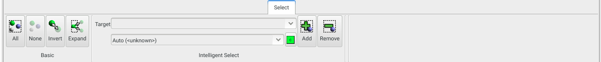
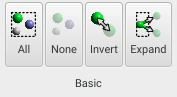
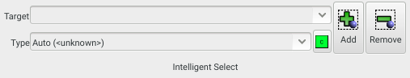

Different methods of selecting atoms can be found on the **Select** panel.

{.imgfull}

## Basic Group <a id="manage"></a>

{.imgfull}

### All

_Shortcut: Ctrl-A_

Selects all atoms in the current model.

### None

Deselects all atoms in the current model.

### Invert

_Shortcut: Ctrl-I_

Inverts the current atom selection, deselecting selected atoms, and selecting deselected ones.

### Expand

_Shortcut:: Ctrl-E_

Expands the current atom selection, adding every atom bound to a currently-selected atom.

## Intelligent Select Group <a id="intelligent"></a>

{.imgfull}

The intelligent select allows ranges or subsets of atoms to be (de)selected by one of several different criteria. The desired atom set should be typed into the **Target** box, and then those matching atoms **Add**ed or **Remove**d from the current selection. **Aten** attempts to auto-detect the exact type of set/range that is being typed, but this may be overriden using the **Type** selector.

The specified atom **Target** may be one of the following:

+ A [NETA](/aten/docs/forcefields/neta) description of an atom (in which case the element should be specified using the element selection button)
+ An atom index or element, or a range thereof
+ A code snippet

These are explained in more detail below.

### NETA Description

A valid [NETA](/aten/docs/forcefields/neta) description of an atom, excluding its character element which should be specified using the element selection button to the right of the **Type** selector.

Examples:

```
-O(nh=1)
```
...would target all atoms of the character element specified that are singly-bound to an oxygen atom with one hydrogen.

```
=C(noring)
```
...would target all atoms of the character element specified that share a double-bond with a carbon atom that is not in a ring.

```
-C(nh=3,n=3)
```
...would target all atoms of the character element specified that have three methyl groups attached.

### Range Selection

A range of atom indices or elements, or an individual atom index or element.  A single atom index or element symbol may be prepended or appended with a '+' symbol to denote 'up to' and 'onwards' respectively.

Examples:

```
1-6
```
...would target atom indices 1 through 6 inclusive.

```
6+
```
...would target all atom indices from 6 and up.

```
+6
```
...would target all atom indices up to and including 6.

```
C-Ne
```
...would target all atoms that are carbon, nitrogen, oxygen, fluorine, or neon.

### Code Select

Executes the supplied snippet of code for each atom - if the result of the code snippet evaluates to **true** then the atom is targeted. A declaration `Atom i;` is prepended to the snippet, meaning that atom information can be probed through the variable `i`.

Examples:

```
i.rx > 0.0;
```
...targets all atoms whose x coordinate is greated than zero.

```
(i.rz < 4.0 && i.element > C);
```
...targets all atoms whose z coordinate is lesss than 4.0 Angstroms **and** that are nitrogens or heavier.

