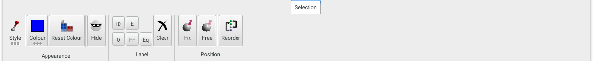
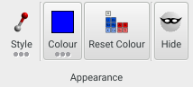
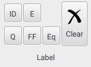
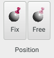

Tools to modify aspects of the current atom selection live on the **Selection** panel, which duplicates much of the functionality of the atom context menu.

{.imgfull}

## Appearance Group 

{.imgfull}

### Style

Select and set the [drawing style](/aten/docs/enums/drawstyle) of the current atom selection (used when using the 'individual' rendering style (Shortcut: F5).

### Colour

Set the colour of the current atom selection, used when the atomic [colouring scheme](/aten/docs/enums/colourscheme) is set to 'custom' (Shortcut: Ctrl-F5).

### Reset Colour

Resets the indivual colours of the current atom selection back to those of their associated elements.

### Hide

_Shortcut: Ctrl-H_

Hides the current atom selection from view.

## Label Group 

{.imgfull}

Allows labels for atom index (ID), element (E), charge (Q), forcefield atom type (FF) and forcefield atom equivalent type (Eq) to be added to the current atom selection.

### Clear

Clears all defined labels for the current atom selection.

## Position Group 

{.imgfull}

### Fix

Flags the current atom selection to be fixed in all minimisation algorithms (i.e. they will not change position).

### Free

Flags the current atom selection to be freely movable in all minimisations algorithms (the default).

