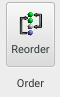

{.imgfull}

## Scripts Group 

{.imgfull}

External command-scripts written in **Aten**'s [scripting language](/aten/docs/scripting) can be managed and run from here.

### Open

Load in (but don't execute yet) an existing script. Long-pressing shows the recent files menu.

### Remove

Remove the currently-selected script.

### Reload

Reload the currently-selected from disk.

### Run

Run the currently-selected script.

## Disorder Group 

{.imgfull}

### Create

Executes the [**Disorder Builder**](/aten/doc/gui/disorder) on the current model.

## Order Group 

{.imgfull}

### Reorder

Attempts to reorder the atoms in the current atom selection so that they may be treated more effectively by a pattern description.  This tool basically helps to fix configurations in which there are a number of repeating units of the same molecule, but whose individual atoms are not in the same order each time (or are completely jumbled up).

## Pores Group 

{.imgfull}

## Surface Group 

{.imgfull}

