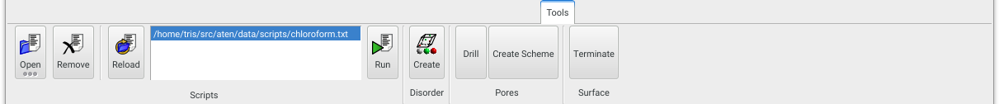
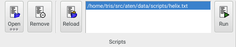
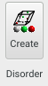
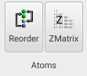
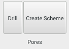
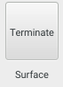

{.imgfull}

## Scripts Group 

{.imgfull}

External command-scripts written in **Aten**'s [scripting language](/aten/docs/scripting) can be managed and run from here.

### Open

Load in (but don't execute yet) an existing script. Long-pressing shows the recent files menu.

### Remove

Remove the currently-selected script.

### Reload

Reload the currently-selected from disk.

### Run

Run the currently-selected script.

## Disorder Group 

{.imgfull}

### Create

Executes the [**Disorder Builder**](/aten/doc/gui/disorder) on the current model.

## Atoms Group 

{.imgfull}

### Reorder

Attempts to reorder the atoms in the current atom selection so that they may be treated more effectively by a pattern description.  This tool basically helps to fix configurations in which there are a number of repeating units of the same molecule, but whose individual atoms are not in the same order each time (or are completely jumbled up).

### ZMatrix

Shows the ZMatrix Editor for the current molecule, allowing atoms to be reordered within the z-matrix, and parameters adjusted.

## Pores Group 

{.imgfull}

### Drill

Allows pores (currently only cylindrical ones) to be drilled in a periodic model. The **Pore Size** value defines the radius of the cylindrical pore, while the **Pore Array** values control how many pores will be drilled in the model. The **Origin Plane** determines the face of the unit cell from which the array of pores will 'begin', while the **Pore Vector** direction controls the orientation of the line along which the pores will be cut. Typically this vector will be perpendicular to the origin face.

**Select Atoms** selects the atoms that would be cut by the current pore definition, while **Drill Pore(s)** selects and removes the atoms, leaving the pores behind.

### Create Scheme

Once pores have been created in a model it is convenient to be able to fill them with something using the [Disorder Builder](/aten/docs/gui/disorder).  To aid this, a custom partitioning scheme can be created from the empty space in the current model (note that this is **any** empty space, and doesn't have to be from the result of pore drilling). The volume of the periodic model is split into a 3D voxel grid, against which the position of each atom is checked.  Any voxel (and potentially those immediately surrounding it - see **Atom Extent** below) that contains an atom is considered as 'filled' and will not be present in any partitioned space. Once all atoms have been checked in this manner, the remaining empty voxels are grouped into contiguous regions, forming the final partitions of the scheme.

The **Grid Size** determines the overall granularity of the partitioning scheme - 50x50x50 is a reasonable default, but may not capture fine structure in complex volumes. The **Minimum Partition Size** is used to define an acceptable lower limit on the smallest partition volume that may be generated, expressed as a percentage of the total grid volume, and allows smaller, unwanted gaps to be ignored. Finally, the **Atom Extent** determines how many adjacent cells are removed (considered as 'filled') when checking atom positions.

Pressing **Generate** runs the algorithm and displays some results on the number of partitions so created. If the results are acceptable, **Copy to Builder** creates a copy of the partitioning scheme in the Disorder Builder, ready for use.

## Surface Group 

{.imgfull}

### Terminate

Adds on H or OH groups to, respectively, any oxygen or silicon atom in the current model that does not have fully satisfied bond requirements.

