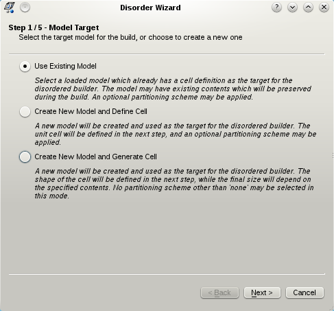
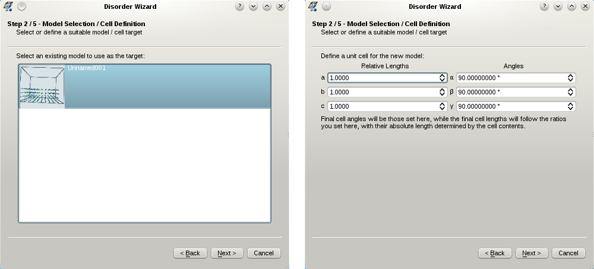
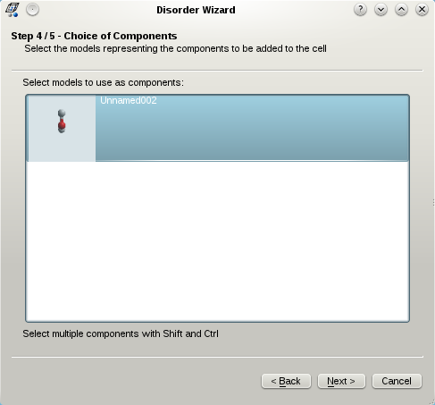
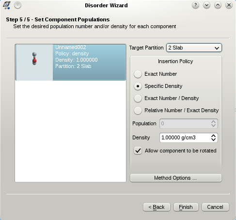

The **Disorder Builder** wizard generates a disordered system involving a collection of molecules. This can be a snapshot of a liquid suitable for use in a molecular dynamics program, a mixture of two or more species, an interface between two or more species, or something more exotic. The disordered builder requires that all molecules which are to be included in the system are currently loaded, and none must have its own cell defined.  However, while all models which are to be ‘inserted into’ the final system may not possess a unit cell, a periodic model can be the target of the insertion, and may contain an existing collection of molecules / atoms.

In order to begin the disordered wizard, click on the **Disorder** icon in the **Edit** section of the main toolbox (see Section 7.5). This will present the first of five steps designed to guide you through the building of your system. 

## Selection of Target Model

{.imgfull}

In the first wizard screen, the type of model target for the builder is selected. If a cell has already been defined in a loaded model choose **Use Existing Model**. The existing model target may already contain molecules, and these will be preserved at their original coordinates during the build. The remaining two choices create a new model for the builder to work on, but differ in how the unit cell is to be defined. **Create New Model and Define Cell** creates a new model for the system with a specific unit cell definition provided by the user, while **Create New Model and Generate Cell** creates a new model with a general cell definition which states only the angles and relative cell lengths required. In the latter case, the final size of the cell will be calculated by **Aten** based on the number and density of the requested molecules defined in subsequent steps. Note that this choice restricts the policy by which molecules are added into the system, requiring a population and density to be specified for every component.  Furthermore, only the basic ‘unit cell’ partitioning scheme may be selected.

## Selection / Definition of Target Cell

{.imgfull}

The second step in the disordered builder either requires selection of an existing model, or definition of the (basic) unit cell, depending on the choice in Step 1:

If **Use Existing Model** was selected in the previous step, a list of currently loaded molecules which have a unit cell are shown, from which one should be selected (left-hand screenshot). If either **Create New Model and Define Cell** or **Create New Model and Generate Cell** was selected in Step 1, the unit cell must now be defined (right-hand screenshot).  In the case of the former, the exact cell definition must be given, and will not be changed further by **Aten**. In the case of the latter, the required cell angles should be given as normal, but the relative lengths of the cell axes should be given rather than the absolute lengths. These lengths are subsequently adjusted by **Aten** based on the number and density of species defined later on.  For instance, defining the relative cell lengths {A, B, C} to be {1.0, 1.0, 1.0} will result in all sides of the cell being identical, while setting them to {1.0, 2.0, 1.0} will give a final cell where the B length is twice as long as both A and C (which are the same).

## Choose Cell Partitioning

{.imgfull}

**Aten** allows each species to be added into a predefined region of the unit cell (unless the cell volume is to be generated, in which case only the basic ‘whole cell’ scheme is available).  The various partitioning schemes available allow the cell to be split up into separate regions, for instance a spherical droplet in the middle of the cell. Many schemes have associated options which alter the size, shape, and position of the various partitions – select **Scheme Options…** to view and customise them. Partitions in the selected scheme are highlighted on the current unit cell as transparent areas.

## Choice of Components

{.imgfull}

In step four the Disorder wizard provides a choice of components to be added into the system.  Any loaded molecule which does not currently have a unit cell is displayed here, and any number of models may be selected for insertion.

## Set Component Populations

{.imgfull}

Finally, the required populations and/or densities for each component model selected in the previous step must be set, as well as the target partition for each. There are four insertion policies available for each component:

**Exact Number** – The component will be added into the system/partition until the desired population has been reached. The density of the component in its partition is not important.

**Specific Density** – The component will be added into the system/partition until the desired density is reached. The population of the component is not important.

**Exact Number / Density** – The component will be added into the system/partition until both the specified population and density are reached. This is the only choice of policy if the cell size is to be determined by **Aten** (**Create New Model and Generate Cell** option in Step 1).

**Relative Number / Exact Density** – The component will be added into the system/partition until the specified density is reached. The total population of the component is variable but will depend on other components with the same policy selected. Over all such components, the relative population ratios between them will be maintained during the build. In this way, mixtures of specific mole ratio can be created, for example.

Note that, when specifying the density of a component, this refers to the density _within that components target partition_. This means that, when multiple components share the same partition (even in the basic unit cell scheme) the density refers to the total density of the partition, as calculated from the sum of contributions from each individual component.  This simply means that the overall density should be defined when sharing partitions between components, rather than that required for each individual component.

The final step of the wizard also allows various parameters of the **Disorder Builder** to be adjusted through the **Method Options** button. A brief description of these options follows:

**Method Accuracy** (default 0.01) - Allowable fractional percentage error in actual vs requested densities
**Maximum Cycles** (default = ?) - Maximum number of cycles to allow when inserting
**Allowed Failures** (default = 5) - The number of successive failed insertions allowed before the scale factor is reduced
**Reduction Factor** (default = 0.98) - The factor by which scale factors are multiplied after reaching the allowed failures limit
**Minimum Scale Factor** (default = 0.95) - Minimum scale factor to allow
**Maximum Scale Factor** (default = 1.15) - Maximum scale factor to allow
**Maximum Tweaks** (default = 5) - Number of tweaks to attempt, per component, per cycle, when recovering
**Tweak Distance** (default = 0.3) - Maximum distance to translate molecule in tweak
**Tweak Angle** (default 5.0) - Maximum angle (each around X and Y) to rotate molecule in tweak
**Max Recovery Cycles** (default = ?) - Maximum number of cycles to allow when recovering

