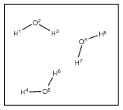
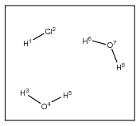
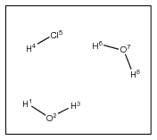
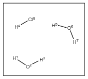

## Overview

Patterns in **Aten** represent collections of molecules of the same type, and are used primarily in the forcefield engine where they allow the construction of compact descriptions of systems where many similar molecules exist (e.g. liquids). A set of patterns describing the contents of a model is often referred to as a _pattern description_. Such a description is generated automatically as and when required by **Aten**, and so in most cases should not need to be defined manually by the user. When **Aten** fails to find a suitable pattern for a model this is often an indication that a bond is missing (perhaps the bond tolerance is too low?) or the atoms present in the system are not in exactly the order you think they are.  When **Aten** fails to find a proper pattern definition for a system, some operations will not be performed (e.g. folding molecules back into the cell with **Model→Fold Molecules**). In these cases it is best to take a careful look at the ordering of atoms and their bonds within a system to try and fix the cause of the problem, but a _default pattern_ can be enforced if absolutely necessary through the main menu’s **Forcefield→Add Default Pattern** option. This description adds in a simple pattern that encompasses all atoms in the model, and therefore always succeeds, at the expense of inefficiency.

A collection of atoms can live quite happily on its own in **Aten**, and can be moved around, rotated, deleted and added to at will. However, if you want to calculate the energy or forces of a collection of atoms (or employ methods that use such quantities) then a description of the interactions between the atoms is required. Creating a suitable expression is the process of taking a system of atoms and generating a prescription for calculating the energy and/or forces arising from these interactions from any standard classical forcefield available.

Patterns describe systems in terms of their constituent molecular units. For an N-component system (a single, isolated molecule is a 1-component system) there are N unique molecule types which are represented as, ideally, a set of N patterns. Forcefield sub-expressions can then be created for each pattern and applied to each molecule within it, allowing the expression for the entire system to be compact and efficient. Each pattern contains a list of intramolecular terms (bonds, angles etc.), atom types, and van der Waals parameters for a single molecule that can then be used to calculate the energy and forces of M copies of that molecule.

## Determination of Patterns

From the atoms and the connectivity between them **Aten** will automatically determine patterns for systems of arbitrary complexity. The ordering of atoms is important, however, and the atoms belonging to a single molecule must not be interspersed by those from others. In other words, the atoms belonging to one instance of a molecule must be listed consecutively in the model. There are also many ways to represent the same system of atoms, all of which (from the point of view of the program) are equivalent and will produce the same total energies and atomic forces.

Consider the following examples:

| | System | Atom Ordering | Automatic Pattern |
|-|--------|---------------|-------------------|
| 1) |  | `H1 O2 H3` `H4 O5 H6`  `H7 O8 H9` | `HOH(3)` |
| 2) |  | `H1 Cl2`  `H3 O4 H5`  `H6 O7 H8` | `HCl(1) HOH(2)` |
| 3) |  | `H1 O2 H3`  `H4 Cl5`  `H6 O7 H8` | `HOH(1) HCl(1) HOH(1)` |
| 4) |  | `H1 O2 H3`  `H4`  `H5 O6 H7` `Cl8` | `HOH(1) H(1) HHO(1) Cl(1)` |

In 1) the three water molecules are identical with respect to the ordering of the atoms, so our description consists of a single pattern describing one HOH moiety. Obvious, huh? The two-component system illustrated in 2) has all molecules of the same type one after the other, giving a simple two-term pattern. However, in 3) the two water molecules are separated (in terms of their order) by the HCl, and so a three-term pattern results. In 4) there are, from the point of view of the program, three distinct molecules, since the ordering of atoms in the two water molecules is different, and so three terms are again necessary in the pattern description.

There are likely to be many possible pattern descriptions for systems, some of which may be useful to employ, and some of which may not be. Take the well-ordered system 1) – four different ways to describe the system are:

`HOH(3)`

`HOH(1) HOH(1) HOH(1)`

`HOH(2) HOH(1)`

`HOH(1) HOH(2)`

All are equivalent and will give the same energies / forces.  Sometimes it is useful to treat individual molecules as separate patterns in their own right since it allows for calculation of interaction energies with the rest of the molecules of the system.

## Pattern Granularity

Patterns work on the basis of bound fragments/molecules, and a molecule cannot be split up smaller than this – for instance in the examples above water cannot be represented by `HO(1) H(1)` since this would ‘neglect’ a bond. However, there is nothing to stop a pattern ‘crossing’ individual molecules. Consider again the example 1) above. Three further (reiterating the point, equivalent) ways of writing the pattern description are:

`HOHHOH(1) HOH(1)`

`HOH(1) HOHHOH(1)`

`HOHHOHHOH(1)`

Here, we have encompassed individual molecular entities into supermolecular groups, and as long as there are no bonds 'poking out' of the pattern, this is perfectly acceptable. Although this coarse-graining is a rather counter-intuitive way of forming patterns, it nevertheless allows them to be created for awkward systems such as that in 4) above. We may write the following valid patterns for this arrangement of atoms:

`HOHHHOHCl(1)`

`HOH(1) HHOHCl(1)`

`HOHHHO(1) HCl(1)`

Note that, when automatically creating patterns, if **Aten** stumbles across a situation that confuses it, the default pattern of one supermolecule will be assumed, i.e. X(1) where 'X' is all atoms in the model.  This will work fine in subsequent energy calculations etc., but will result in rather inefficient performance.

