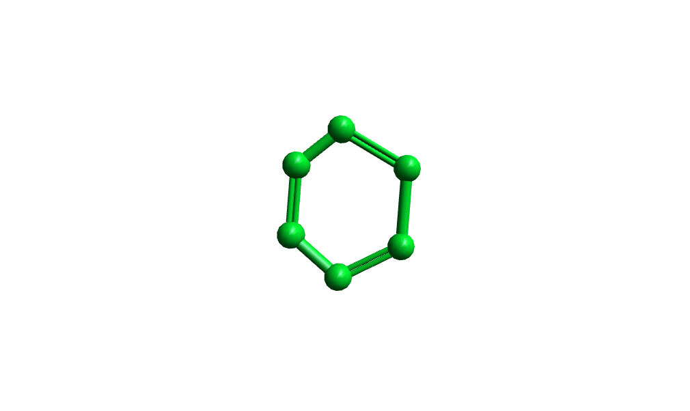
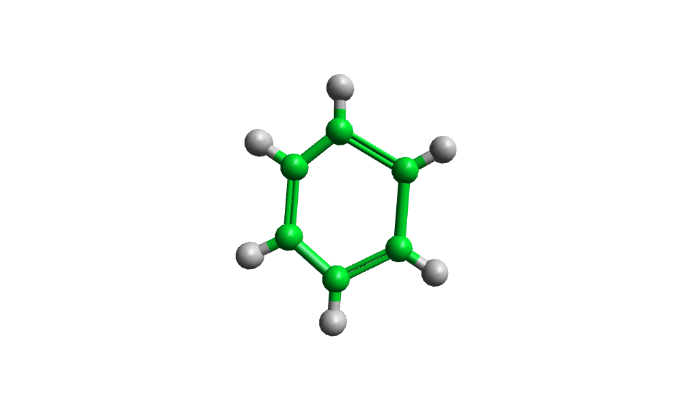
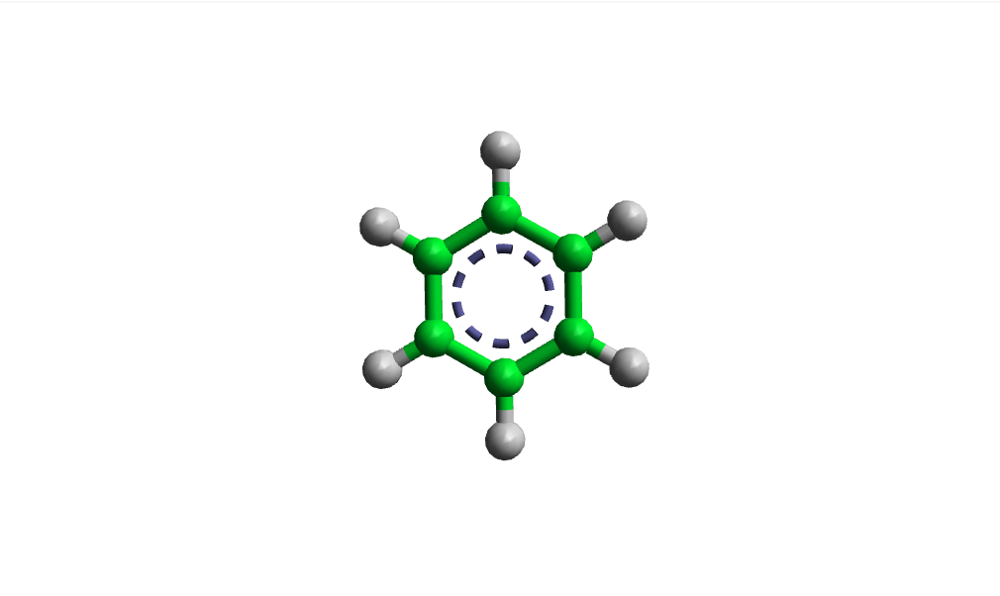
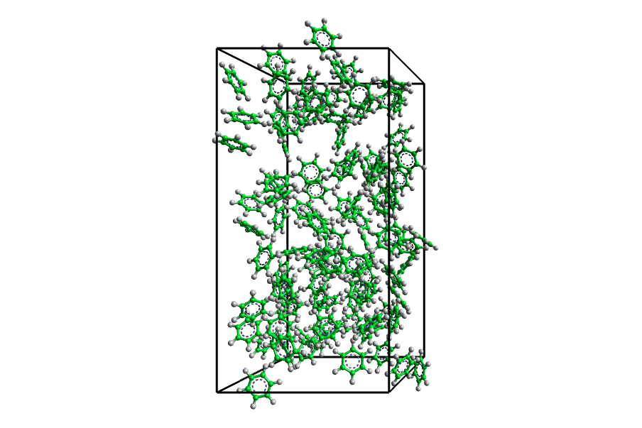

This example will demonstrate how to make a disordered starting configuration for simulation of a simple liquid (benzene), exporting the coordinates and forcefield expression in a format suitable for DL_POLY.

## Create a Bad Benzene Molecule

First we must create a single molecule of benzene that we will then use as a source model in the [Disorder Builder](/aten/docs/gui/disorder). On the [**Build Panel**](/aten/docs/gui/build) select the **Draw** tool - single-clicking somehwere in the model view will draw an unbound atom, while click-dragging allows atoms and bonds to be drawn at the same time. Also, clicking on an atom and dragging the mouse to a second atom will create a bond between the two, and drawing over an existing bond in this way will increase the multiplicity of the bond.

So, draw a ring of six carbon atoms with alternating double bonds, and you should have something atrocious like this:

{.imgfull}

The presence of the double bonds is important, since it means we can add hydrogen atoms to our model automatically - on the [**Build Panel**](/aten/docs/gui/build) long-press the **Add H** tool and choose the **Model** option from the popup to add hydrogens to every atom in the model.

{.imgfull}

## Turn a Bad Benzene into a Good Benzene

The geometry of our benzene molecule is quite poor, so we should tidy it up a bit before we create our disordered system. On the [**Forcefields Panel**](/aten/docs/gui/forcefields) click **Open** and navigate to **Aten**'s installed [`data` folder](/aten/docs/installation/data), go into the `ff` folder, and choose `opls-aa.ff`. We now have a forcefield on-hand to be able to optimise the geometry of the model. Note that the [Disorder Builder](/aten/docs/gui/disorder) itself does not require a loaded forcefield in order to function.

After clicking the **Minimise** button on the [**Forcefields Panel**](/aten/docs/gui/forcefields) a few times (which will run the default, steepest-descent minimiser on the current model) you should have something a little better looking:

{.imgfull}

## Create a Condensed Phase

Now that we have a good source model for the [Disorder Builder](/aten/docs/gui/disorder), it's time to run it!  On the [**Tools Panel**]/aten/docs/gui/tools) click the **Create** button in the **Disorder** group to run the wizard.

The first step is to choose the kind of target model - there are several options for this, but in the present case we will choose the last option (**Create New Model and Generate Cell**). This allows us to define the basic shape of the unit cell, but leave it up to **Aten** to calculate the final volume based on what we tell it to put in the cell. On step two of the wizard we can define the relative cell lengths and angles - the default is a cubic cell (relative lengths all set to 1.0), but you may change any of these values if you wish. For this example I have lenghthened the cell along the cell's _b_ direction (relative length of 2.0) and changed the &beta; angle to 110.0&deg;.

Step three is the selection of a partitioning scheme for the unit cell, which allows us to add molecules into different regions of space (see the [partitions example](/aten/docs/examples/partitions)). However, since we have chosen the flexible cell option, the only choice available to us is the simplest case where the only available volume is that of the unit cell itself. Choose it and click **Next**.

Step four allows us to choose the models that we will add into the unit cell - again, there is only one choice (the benzene molecule we created in the first stage of this example) so select it and clidk **Next**.

Finally, in step five we can define 'how much' of each molecule we have selected we want in the cell. Our choice of flexible cell again limits our options here to one choice of insertion 'policy' which requires both the number of molecules and the desired condensed phase density of those molecules to be defined (without both, the total volume of the unit cell can't be determined). Set the number of molecules to some number (perhaps 100 or more) and the density to 0.876 g/cm3, then click the **Finish** button. Et voila - one disordered system.

{.imgfull}

## Exporting DL_POLY Files

The final task is to assign forcefield types (from the `oplsaa` forcefield) to the model - this is a simple matter of going to the [**Forcefields Panel**](/aten/docs/gui/forcefields) and clicking the **Describe** tool, which will attempt to type atoms and create a full energy expression for the current model, using the current forcefield. Then, we can click the **Save** button of the **Expression** group to export the energy expression of the model as a DL_POLY FIELD file.

Since we have **Describe**d the model already, every atom will have an atom type associated to it (necessary information for creating the associated DL_POLY CONFIG file). On the [**Home Panel**](/aten/docs/gui/home) click **Save As** to save the model as a DL_POLY Configuration File, and we are done.

Of course, to run DL_POLY properly you will also need a CONTROL file, which **Aten** won't (yet) give you. Can't have it all!

