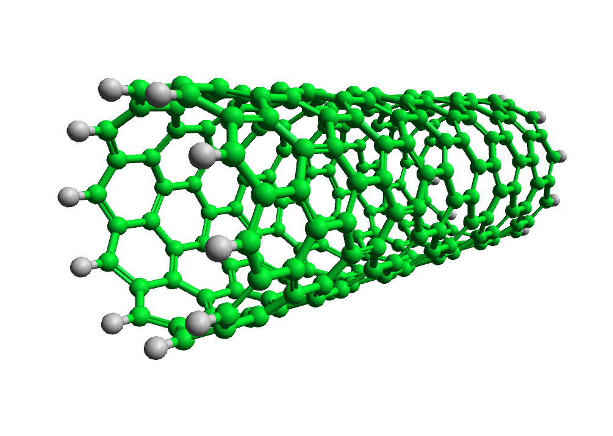

The script below generates a graphene tube (a "Buckytube", if you will) of some user-defined length and radius. We'll walk through each of the sections of the script in turn (the script is presented in its entirety at the end of the page, and can be found in the example scripts directory included with **Aten**).

## Defining User Options

```aten
# Create an options dialog
void createDefaultDialog(Dialog ui)
{
        Widget w;

        # Set title and vertical automatic filling of main dialog layout
        ui.title = "Bucky Tubulator";

	# Basic controls
	ui.verticalFill = TRUE;
	ui.addIntegerSpin("nBenzeneSpin", "Number of benzenes around circumference", 4, 1000, 1, 10);
	ui.addIntegerSpin("nStacksSpin", "Number of stacks along tube length", 1, 1000, 1, 10);
	ui.addDoubleSpin("bondLengthSpin", "Benzene C-C bond length", 0.1, 100.0, 0.01, 1.39);
	ui.addCheck("createModelCheck", "Create new model", 1);
}
```

Firstly, before we do anything else, we define a function called [`createDefaultDialog()`](/aten/docs/scripting/commands/messaging#createdefaultdialog) which sets up a few controls that will allow the user to control the dimensions of the generated tube. The name of this function is important, since it is one that **Aten** looks for in each script to determine if a general options dialog is present (see [Creating User Dialogs](/aten/docs/topics/dialogs) for more information). We define a couple of 'spin boxes' that will give control over the number of benzene subunits along the length and circumference of the tube, as well as allow the C-C bond length used to be changed. Finally, a checkbox gives the option to create a new model to contain the generated tube (or just to add it to the current model).

## Show the Options

Defining the options and their controls is one thing, but they must be presented to the user! This is achieved by calling the [`showDefaultDialog()`](/aten/docs/scripting/commands/messaging#showdefaultdialog) function, which shows the controls defined in the [`createDefaultDialog()`](/aten/docs/scripting/commands/messaging#createdefaultdialog) function above.

Once shown, and if accepted, we then proceed to extract the necessary control values into some local variables we will use in the rest of the script. First, we get the reference to the dialog itself by calling the [`defaultDialog()`](/aten/docs/scripting/commands/messaging#defaultdialog) and then grab the other values we need, simply by calling the relevent `as*()` function of the dialog, and giving the name of the control from which we want to extract (and convert) the value.

```aten
# Show (execute) the dialog to allow user interaction.
# The function returns 0 for 'canceled' or '1' for 'ok'
if (!showDefaultDialog()) error("Dialog canceled.\n");

# Get widget values
Dialog ui = defaultDialog();
int nbenz = ui.asInteger("nBenzeneSpin");
int nstacks = ui.asInteger("nStacksSpin");
double rcc = ui.asDouble("bondLengthSpin");
```

## Preparation

Before we start creating our tube, we'll declare some variables and, if it was requested, create a new model for the tube to live in. Since we have made it an option whether to use the current model or create a new one, we use a [**Model**](/aten/docs/scripting/variabletypes/model) to store the reference to the target, and call all the drawing functions through it instead of using the global functions (see [Building Commands](/aten/docs/scripting/commands/building)).

```aten
int loop, benz;
Atom hAtom;

// Calculate rotation increment around circumference
double dz = 360.0/(nbenz*2.0)

# Create / get target model
Model targetModel;
if (ui.asInteger("createModelCheck")) targetModel = newModel("BuckyTube");
else targetModel = aten.frame;
if (!targetModel) error("No valid target model.\n");

# Clear the current selection, ready for the main loop
targetModel.selectNone();
```

## Main Loop

We finally get to the main loop that will create our atoms. The tube is constructed by drawing one ring of 'zig-zagged' atoms at a time, then moving a step along the tube and rotating about z before drawing the next ring. The offset so created naturally forms the benzene motifs we need.

Checks are made to see if we are at either extreme end of the tube, in which case a terminating hydrogen atom is bonded on to the associated carbon.

```aten
# Outer loop - loop over stacks
for (loop=0; loop <= nstacks; ++loop)
{
	# Inner loop - loop over benzene molecules
	for (benz=0; benz<nbenz; ++benz)
	{
		# If at beginning of tube, draw terminating H
		if ((loop == 0) || (loop == nstacks))
		{
			targetModel.movePen(0, 0, -1);
			targetModel.select(targetModel.newAtom(H));
			targetModel.movePen(0, 0, 1);
		}

		# Draw and select first carbon
		targetModel.select(targetModel.newAtom(C));

		# Rotate pen and move around circumference
		targetModel.movePen(rcc*cos(30), 0.0, rcc*sin(30));
		targetModel.rotatePenZ(dz);

		# If at end of tube, draw terminating H
		if (loop == nstacks)
		{
			targetModel.movePen(0, 0, 1);
			targetModel.select(targetModel.newAtom(H));
			targetModel.movePen(0, 0, -1);
		}

		# Draw and select second carbon
		targetModel.select(targetModel.newAtom(C));

		# Rotate pen and move around circumference
		targetModel.movePen(rcc*cos(30), 0, -rcc*sin(30));
		targetModel.rotatePenZ(dz);
	}
	
	# Move pen along tube length, and one step around circumference to offset next layer
	targetModel.movePen(0, 0, rcc*1.5);
	targetModel.movePen(rcc*cos(30), 0, 0);
	targetModel.rotatePenZ(dz);
}
```

## Cleanup

To tidy up, we centre the current selection of atoms (which is every atom we have just drawn) at {0,0,0} and calculate bonding within that selection (since we did not draw any bonds along the way, only atoms).

```aten
# Centre the selection, rebond and augment
targetModel.centreSelection(0.0, 0.0, 0.0);
targetModel.rebondSelection();
```

{.imgfull}

## Full Script

File: [buckytube.txt](./buckytube.txt)

```aten
# Create an options dialog
void createDefaultDialog(Dialog ui)
{
        Widget w;

        # Set title and vertical automatic filling of main dialog layout
        ui.title = "Bucky Tubulator";

	# Basic controls
	ui.verticalFill = TRUE;
	ui.addIntegerSpin("nBenzeneSpin", "Number of benzenes around circumference", 4, 1000, 1, 10);
	ui.addIntegerSpin("nStacksSpin", "Number of stacks along tube length", 1, 1000, 1, 10);
	ui.addDoubleSpin("bondLengthSpin", "Benzene C-C bond length", 0.1, 100.0, 0.01, 1.39);
	ui.addCheck("createModelCheck", "Create new model", 1);
}

# Show (execute) the dialog to allow user interaction.
# The function returns 0 for 'canceled' or '1' for 'ok'
if (!showDefaultDialog()) error("Dialog canceled.\n");

# Get widget values
Dialog ui = defaultDialog();
int nbenz = ui.asInteger("nBenzeneSpin");
int nstacks = ui.asInteger("nStacksSpin");
double rcc = ui.asDouble("bondLengthSpin");

int loop, benz;
Atom hAtom;

// Calculate rotation increment around circumference
double dz = 360.0/(nbenz*2.0)

# Create / get target model
Model targetModel;
if (ui.asInteger("createModelCheck")) targetModel = newModel("BuckyTube");
else targetModel = aten.frame;
if (!targetModel) error("No valid target model.\n");

# Clear the current selection, ready for the main loop
targetModel.selectNone();

# Outer loop - loop over stacks
for (loop=0; loop <= nstacks; ++loop)
{
	# Inner loop - loop over benzene molecules
	for (benz=0; benz<nbenz; ++benz)
	{
		# If at beginning of tube, draw terminating H
		if ((loop == 0) || (loop == nstacks))
		{
			targetModel.movePen(0, 0, -1);
			targetModel.select(targetModel.newAtom(H));
			targetModel.movePen(0, 0, 1);
		}

		# Draw and select first carbon
		targetModel.select(targetModel.newAtom(C));

		# Rotate pen and move around circumference
		targetModel.movePen(rcc*cos(30), 0.0, rcc*sin(30));
		targetModel.rotatePenZ(dz);

		# If at end of tube, draw terminating H
		if (loop == nstacks)
		{
			targetModel.movePen(0, 0, 1);
			targetModel.select(targetModel.newAtom(H));
			targetModel.movePen(0, 0, -1);
		}

		# Draw and select second carbon
		targetModel.select(targetModel.newAtom(C));

		# Rotate pen and move around circumference
		targetModel.movePen(rcc*cos(30), 0, -rcc*sin(30));
		targetModel.rotatePenZ(dz);
	}
	
	# Move pen along tube length, and one step around circumference to offset next layer
	targetModel.movePen(0, 0, rcc*1.5);
	targetModel.movePen(rcc*cos(30), 0, 0);
	targetModel.rotatePenZ(dz);
}

# Centre the selection, rebond and augment
targetModel.centreSelection(0.0, 0.0, 0.0);
targetModel.rebondSelection();
```

