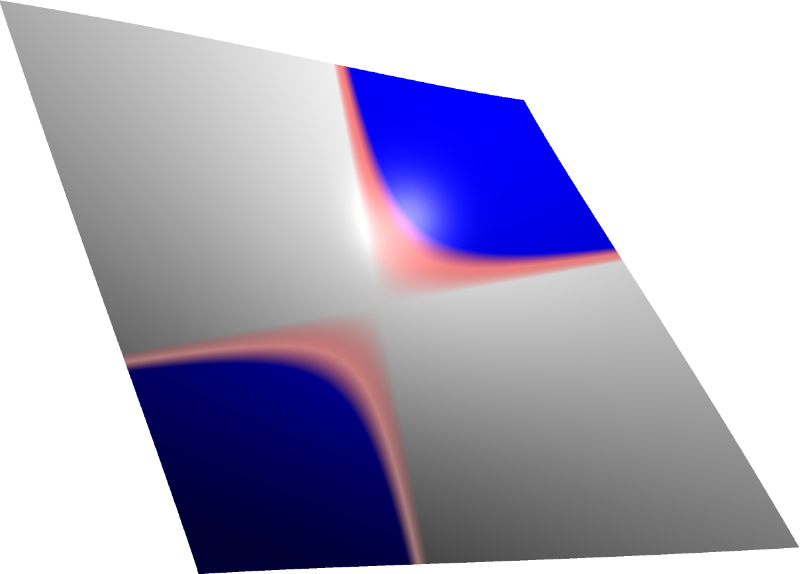

This example demonstrates the use of [Glyphs](/aten/docs/topics/glyphs) by creating a height-map rendering of a 2D function, discretised over a regular grid of points. To give the plotted function some character we use a [ColourScale](/aten/docs/topics/colourscales) to give the surface a nice semi-transparent gradient.

The script for this example can be found in `data/scripts/plotxy.txt`.

```aten
# Setup some variables - number of points and step deltas
double deltax = PI/15.0, deltay = PI/15.0;
int nx = 150, ny = 150, ix, iy;

double x, y, fxy, slice1[2*ny+1], slice2[2*ny+1], r, g, b, a;

Model m = newModel("Function Plot");
Glyph gl;

# Set up a colourscale to colour the plot nicely
ColourScale cs = aten.prefs.colourScales[8];
cs.clear();
cs.addPoint(0.0,1,1,1,1.0);
cs.addPoint(1.0,1,0,0,0.5);
cs.addPoint(2.0,0,0,1,1.0);

# Double loop over x and y
for (ix = 0; ix <= 2*nx; ++ix)
{
	# Set current x coordinate
	x = (ix-nx) * deltax;

	# Calculate slice of values at fixed x
	for (iy = 0; iy <= 2*ny; ++iy)
	{
		y = (iy-ny) * deltay;

		# ***
		# Function to plot goes in here!
		# ***
		fxy = 100*sin(x)*sin(y);
		#fxy = cos(abs(x)+abs(y))*(abs(x)+abs(y));
		#fxy = sin(10.0*(x^2+y^2));
		# ***

		slice2[iy+1] = fxy;
	}

	# Generate glyphs (only if not first iteration of ix)
	if (ix > 0)
	{
		for (iy = 1; iy <=2*ny; ++iy)
		{
			# Set current y coordinate
			y = (iy-ny) * deltay;

			# Create a new glyph
			gl = m.newGlyph("triangle");

			# For each vertex use the ColourScale to 
			# work out its colour
			cs.colour(slice1[iy], r, g, b, a);
			gl.data[1].vector = { x-deltax, y-deltay, slice1[iy] };
			gl.data[1].colour = { r, g, b, a };

			cs.colour(slice1[iy+1], r, g, b, a);
			gl.data[2].vector = { x-deltax, y, slice1[iy+1] };
			gl.data[2].colour = { r, g, b, a };

			cs.colour(slice2[iy], r, g, b, a);
			gl.data[3].vector = { x, y-deltay, slice2[iy] };
			gl.data[3].colour = { r, g, b, a };

			# And the other half of the quad
			gl = m.newGlyph("triangle");
			cs.colour(slice2[iy], r, g, b, a);
			gl.data[1].vector = { x, y-deltay, slice2[iy] };
			gl.data[1].colour = { r, g, b, a };

			cs.colour(slice1[iy+1], r, g, b, a);
			gl.data[2].vector = { x-deltax, y, slice1[iy+1] };
			gl.data[2].colour = { r, g, b, a };

			cs.colour(slice2[iy+1], r, g, b, a);
			gl.data[3].vector = { x, y, slice2[iy+1] };
			gl.data[3].colour = { r, g, b, a };
		}
	}

	# Copy slice2[] values into slice1[] for next pass
	for (iy = 0; iy <=2*ny; ++iy) slice1[iy+1] = slice2[iy+1];
}
```

{.imgfull}
