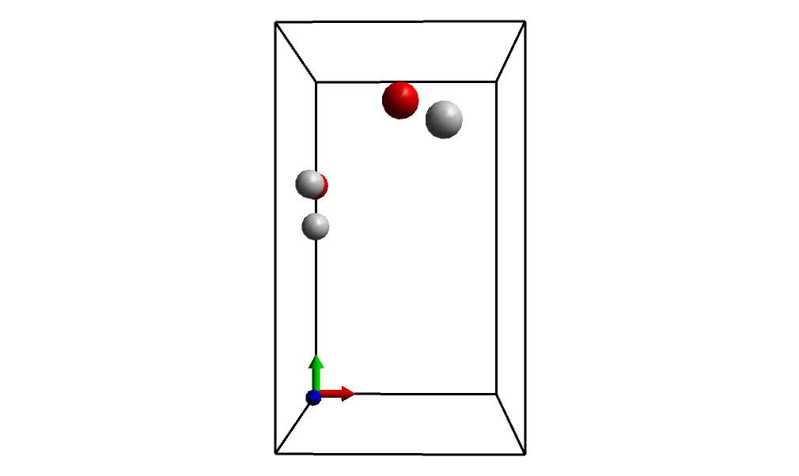
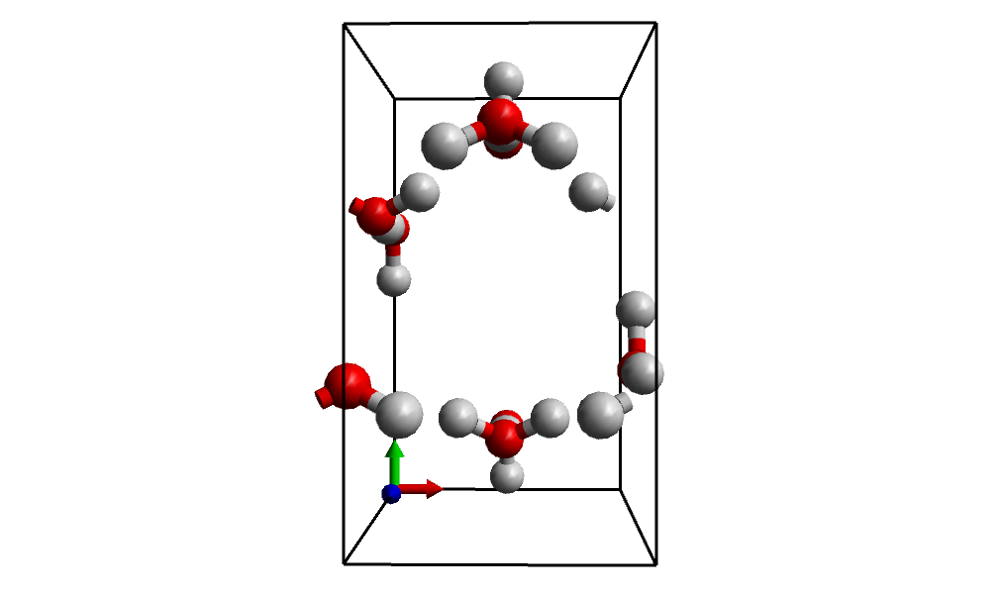
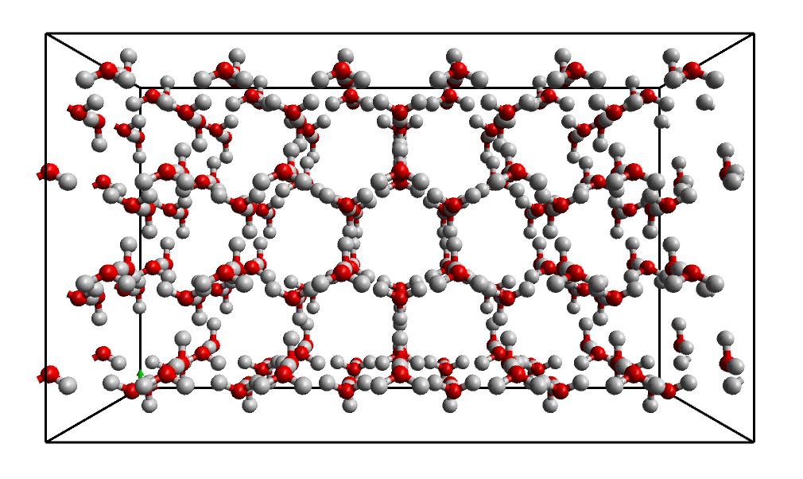

Similar in spirit to the [alumina example](/aten/docs/examples/alumina), here we create a single ice I<sub>h</sub> crystal from the crystal information, and then replicate it to form a larger supercell. The crystal information used below is from Leadbetter _et al._, _J. Chem. Phys._, **82**, 424 (1985), Table II (Structural parameters of ice at 5 K).

## Create the Basic Unit Cell

First, we create the unit cell, which from the paper is orthorhombic with side lengths **A** = 4.5019, **B** = 7.7978, and **C** = 7.328 Å. There are five symmetry-unique atoms to add into the cell. This might seem odd given that this doesn't add up to a whole number of water molecules, but one of the water molecules lays with its oxygen on a mirror plane, and so only needs one hydrogen to be specified. Atom positions in the paper are given in fractional coordinates - we will create the atoms using these coordinates which will be converted by **Aten** into their real (cell) coordinates automatically.

{.imgfull}

+ Go to the [**Define Group**](/aten/docs/gui/cell#define) on the [**Cell Panel**](/aten/docs/gui/cell), and enable the **Periodic** button to add a basic unit cell to our empty model.
+ Using the **Lengths** tool enter the cell lengths _a_, _b_, and _c_ to 4.5019, 7.7978, and 7.328 &#8491; respectively. The cell **Angles** should all be 90°.

On the [**Build Panel**](/aten/docs/gui/build) change the drawing **Element** to oxygen, and then open the **Add Atom** tool. We will specify the new atoms in fractional cell coordinates, so make sure that the **Fractional** checkbox is ticked.

Add oxygen atoms at the following positions:

| Atom | FracX | FracY | FracZ |
|------|-------|-------|-------|
|  O1  | 0.0   | 0.6648| 0.0631|
|  O2  | 0.5   | 0.8255|-0.0631|

Change the **Element** to hydrogen and add hydrogen atoms at the following positions:

| Atom | FracX | FracY | FracZ |
|------|-------|-------|-------|
|  H1  | 0.0   | 0.6636| 0.1963|
|  H2  | 0.0   | 0.5363| 0.0183|
|  H3  | 0.6766|-0.2252|-0.0183|

The cell should now look like this:

{.imgfull}

## Set the Spacegroup and Pack

Back on the [**Cell Panel**](/aten/docs/gui/cell) we now must set the correct spacegroup for the model, so that the full unit cell can be generated from the set of symmetry-unique atoms we have just entered. On the **Define** tool we can set the correct spacegroup (Cmc21) for the model - in the **Set / Lookup** section you can either choose the correct spacegroup from the drop-down list, or enter the name or number (36, in this case) for the spacegroup required. Once selected, press **Set** to assign it to the model, then press **Pack** to pack the unit cell with symmetry-generated atoms.

Finally, click **Rebond** on the [**Build Panel**](/aten/docs/gui/build).

{.imgfull}

To complete the model the spacegroup of the crystal must be set so that generation of the symmetry-related atoms can be performed.

## Replicate Cell

The basic cell of ice Ih isn’t particularly interesting by itself, so we will replicate the cell to create a larger supercell, and then calculate bonds in the new model so that the hexagonal structure is clear to see.

On the [**Build Panel**](/aten/docs/gui/build) long-press the **Replicate** tool and enter positive replication values of, say, 6 for _x_, 2 for _y_, and 2 for _z_. Close the tool, then single click the **Replicate** to create the supercell. The bonding will now not be pretty, so hit **Rebond** as well.

{.imgfull}

## Script

```aten
# Create periodic model
newModel("ice");
cell(4.5019,7.7978,7.3280,90,90,90);

# Add symmetry-unique atoms
newAtomFrac(O,0,0.6648,0.0631);
newAtomFrac(O,0.5,0.8255,-0.0631);
newAtomFrac(H,0,0.6636,0.1963);
newAtomFrac(H,0,0.5363,0.0183);
newAtomFrac(H,0.6766,-0.2252,-0.0183);

# Set spacegroup, pack, replicate, and rebond
spacegroup("Cmc21");
pack();
replicate(0,0,0,6,2,2);
rebond();
```


