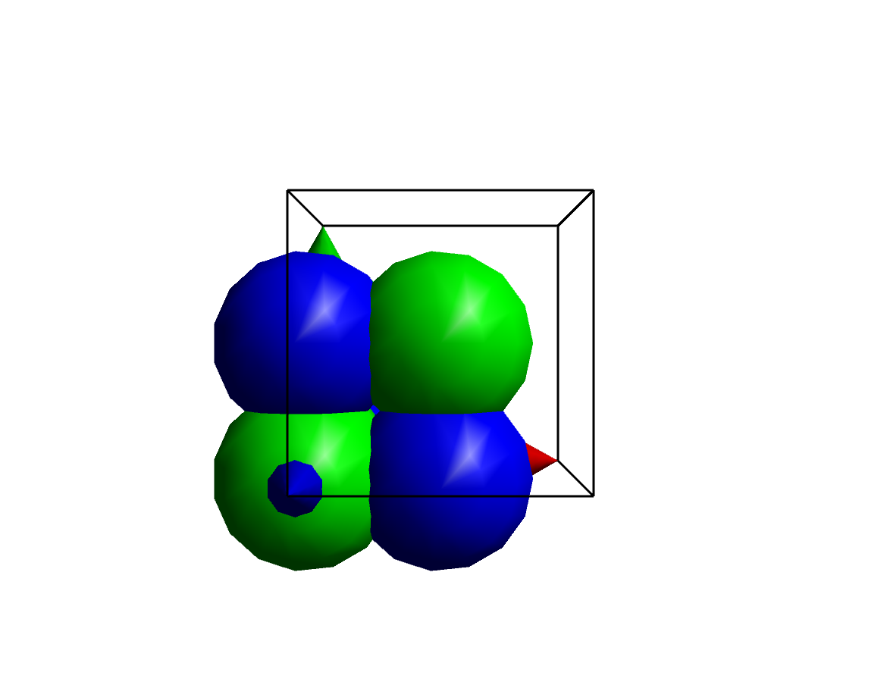
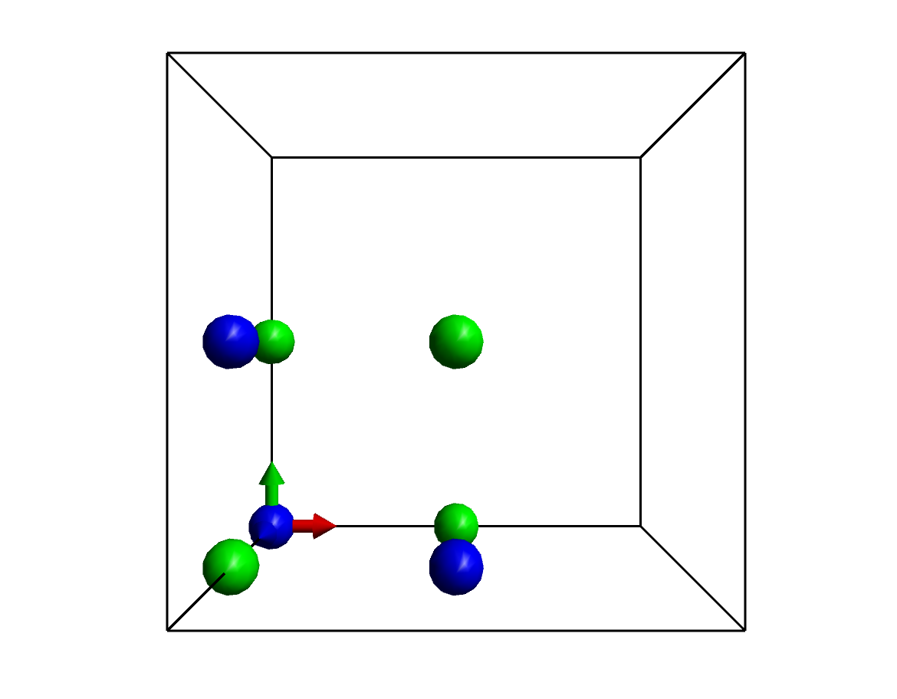
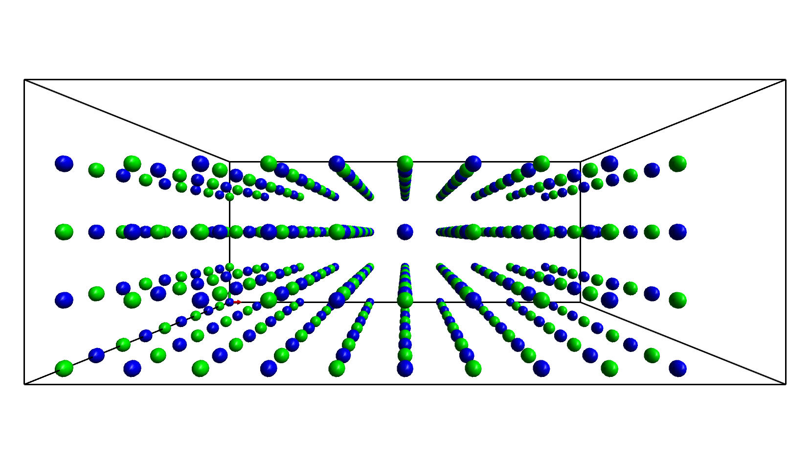
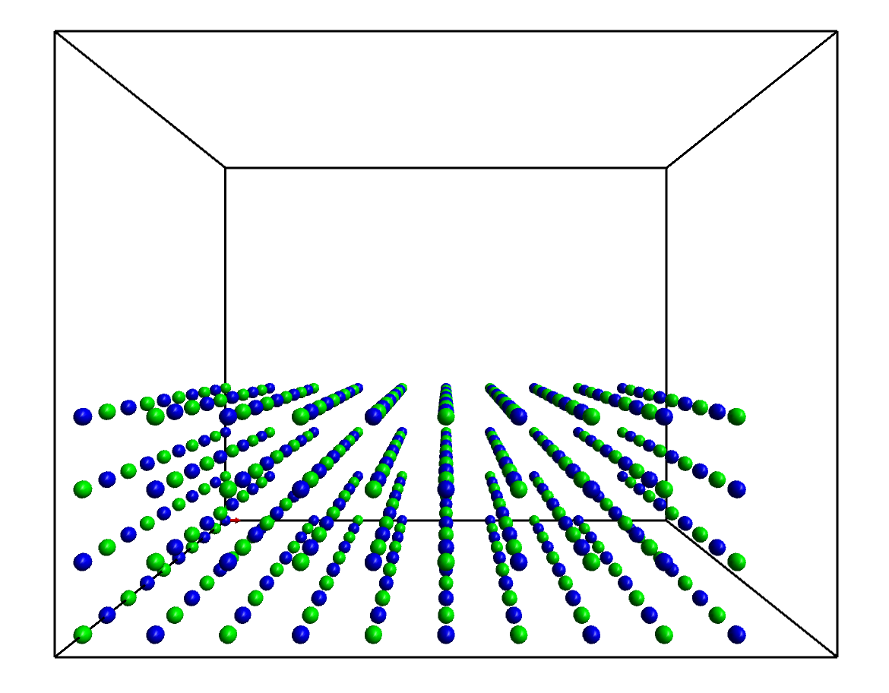
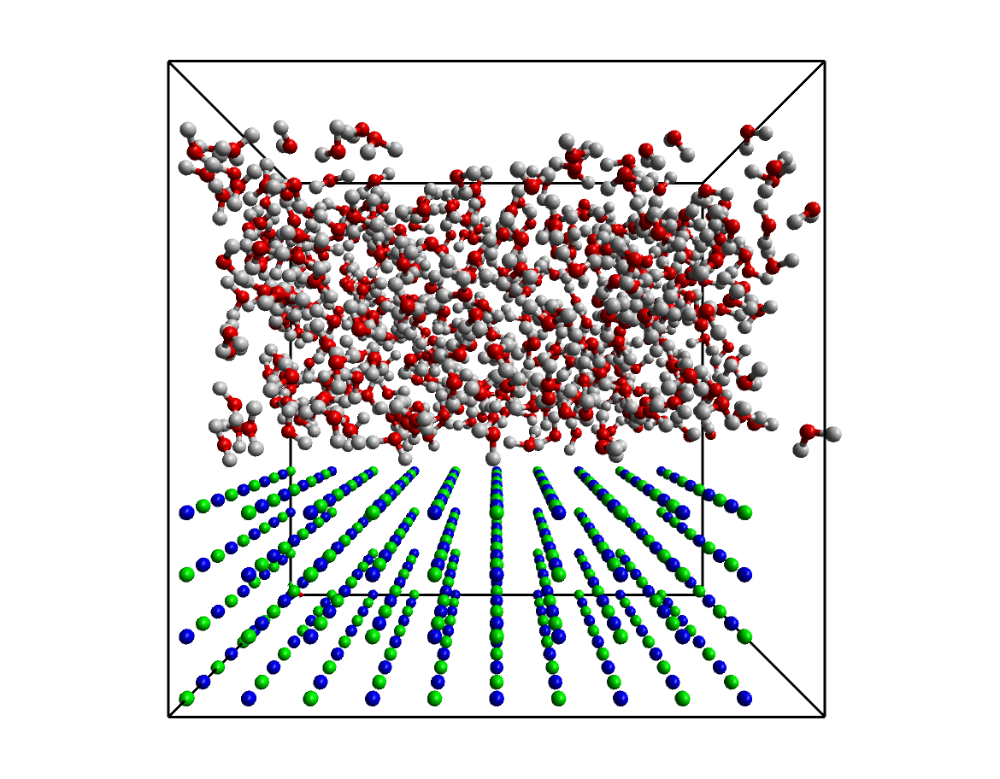

It’s often necessary to create a larger system from a simple (or complex) unit cell, for example to generate bulk supercells of crystals, sufaces etc.  The method outlined below shows how to do this for a simple crystal, and then extends this system to create a solid-liquid interface.

## Create the Template Model

First off, we will create a basic FCC template model which has a unit cell of exactly 1 Å, with atoms at {0,0,0}, {0.5,0.5,0}, {0.0,0.5,0.5}, and {0.5,0.0,0.5}, representing the basic positions of atoms in a face-centred cubic lattice.

In an empty (new) model, go to the [**Cell Panel**](/aten/docs/gui/cell) and enable the unit cell with the **Periodic** button, and then use the **Lengths** tool to set each cell axis length to 1.0 &#8491;.

Now, go to the [**Build Panel**](/aten/docs/gui/build) and **Add Atom**s (it doesn't matter which element they are, as we will **Transmute** them later) at {0.0,0.0,0.0}, {0.5,0.5,0.0}, {0.0,0.5,0.5}, and {0.5,0.0,0.5}. You should end up with something that looks like this:

{.imgfull}

If the atoms are not sodium atoms already, transmute them now - select all four atoms, set the drawing **Element** to Na, and then long-press on the **Transmute** tool and transmute the whole **Selection**.

We now need a second, interpenetrating FCC lattice of chlorine atoms. We could add each atom by hand as we did previously, but there are easier ways. Select all four sodium atoms, copy them (**Ctrl-C**) and then paste them back down (**Ctrl-V**). Don't deselect them yet! We will use the **Flip** tool on the [**Transform Panel**[(/aten/docs/gui/transform) to flip them once in any direction.  Still with the atoms selected, set chlorine as the drawing element (**Build Panel&#8594;Element**) and then **Transmute** the **Selection** again.

{.imgfull}

## Scale and Replicate Unit Cell

We wish to scale the cubic unit cell of the model (currently with side length _l_ = 1.0 Å) to correspond to the unit cell of sodium chloride (_l_ = 5.628 Å). The cell can be scaled by a different amount in each Cartesian axis, but since we want to end up with a cubic cell we must scale each axis by the same amount. On the [**Cell Panel**](/aten/docs/gui/cell) long-press the **Scale** tool to get the options, and set the scale factors in x, y, and z to 5.628 &#8491. Then single-press the **Scale** button to perform the scaling, which should result in a cell with the atoms properly spaced out:

{.imgfull}

Now the model represents the proper sodium chloride unit cell we can replicate it to create a larger system. **Aten** can replicate a basic cell by any integer or non-integer amount along each of the three principal cell axes, but here we will stick to integer amounts. We can also specify both negative and positive replication amounts for each direction, if we wanted to. Note that the values given in the **Replicate** tool represent the size which we require, including the original unit cell, so input values (negative/positive) of {0,0,0} and {1,1,1} will result in an unchanged cell.

Long-press the **Replicate** tool and set positive replication amounts to 5 for _x_ and _z_, and 2 for _y_. Leave the negative direction amounts at zero. Single-click the **Replicate* tool to perform the replication, and a slab should result:

{.imgfull}

## Create an Interface

It's a simple job to create an interface from the current system - all we need do is increase the cell dimension along the _y_ direction (the cell’s _b_ length) - on the [**Cell Panel**](/aten/docs/gui/cell), use the **Lengths** tool to double the _y_ length of the cell.

{.imgfull}

## Make a Water Model

We will now create a water molecule in a separate model so we can add it in to the NaCl cell using the Disorder Builder.

Create a new, empty model (if you don’t have one already) with **New** on the [**Home Panel**](/aten/docs/gui/home). On the [**Build Panel**](/aten/docs/gui/build) set the drawing **Element** to carbon, and activate the **Draw** tool. Left-click once in the model to draw an oxygen atom. Then, use the **Add H** tool to add hydrogens to it - activate the tool, and single-click on the oxygen atom.

## Add Water to the NaCl Cell

It’s time to run the disorder builder on the system. We’ll instruct the builder to add water in to the extended NaCl cell, but only into the part which is empty. On the [**Tools Panel**](/aten/docs/gui/tools) select the **Disorder** tool to run the wizard. The steps in the wizard are as follows:

### 1. Model Target

We wish to add in water to an existing system in this example, so choose the top option (**Use Existing Model**) and press **Next**.

### 2. Model Selection / Cell Definition

You then need to choose the target model for the builder - there should be only one which is the extended NaCl system we just created. Select it and press **Next**.

### 3. Choose Cell Partitioning

Now we choose the partitioning scheme for the system. We could be lazy and just choose “None”, since the NaCl lattice should ‘reject’ any water molecule we attempt to add over it. However, here we will choose an appropriate partitioning scheme for the task, “SlabXZ”. This will allow us to restrict water molecules to a specific _y_-range in the unit cell. Select “SlabXZ” and press the **Scheme Options** button to bring up the options dialog for the scheme. There you will see the start and end values of _y_ for the slab (in fractional cell coordinates). The initial minimum limit of 0.4 is, luckily, appropriate for the system, but the upper bound needs to be set to 1.0. Press **OK** when done and then **Next**.

### 4/5. Choice and Setup of Components

Finally, model selection and preparation. Select the water molecule from the list and press **Next** to get to the component setup page.  We must change the **Target Partition** of the water molecule to 2 (the slab we defined earlier), and then request that a **Specific Density** of molecules be inserted into this partition (the default of 1.0 g/cm3 is fine). Once this information has been entered, press **Finish** to start the build.

{.imgfull}

## Script

The script below creates the water molecule as the first step to make life a little easier.

```aten
# Create water model
newModel("Water");
newAtom(O);
addHydrogen();
setupComponent("density", 2, 0, 1.0);

# Create NaCl lattice
newModel("fcc");
cell(1,1,1,90,90,90);
newAtom(Na,0,0,0);
newAtom(Na,0.5,0.5,0);
newAtom(Na,0.5,0,0.5);
newAtom(Na,0,0.5,0.5);
selectAll();
copy();
paste();
flipX();
transmute(Cl);

# Scale, replicate and extend cell
scale(5.628,5.628,5.628);
replicate(0,0,0,5,2,5);
setCell("b",28.12);

# Add water
disorder("SlabXZ,end=1.0");
```

