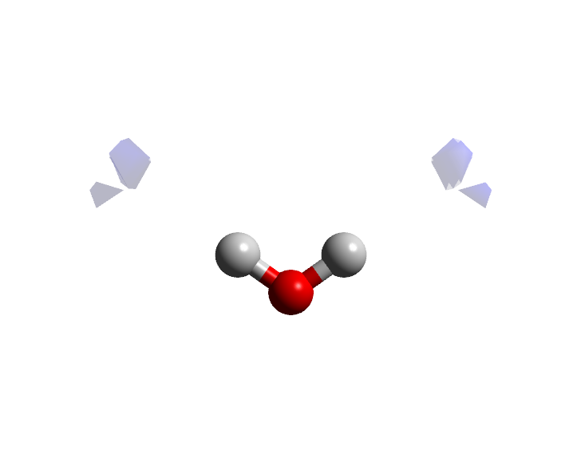
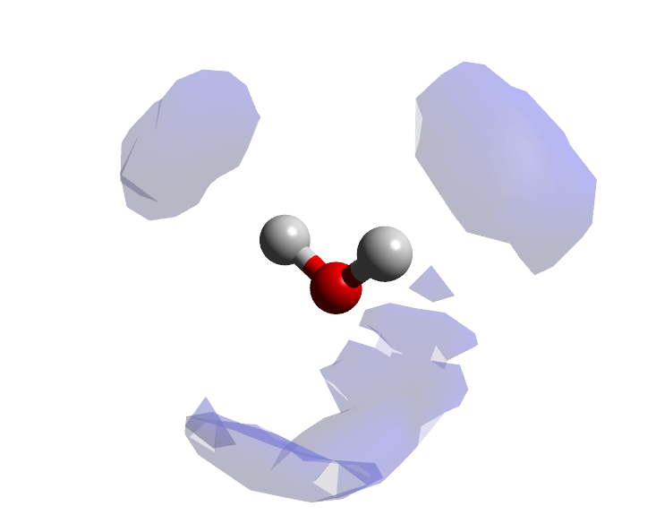

Visualisation of three-dimensional probability densities (often called spatial density functions, or spatial probability densities) is extremely useful when trying to interpret and understand the organisation of molecules relative to one another in a given system. This example uses example water data to illustrate the concept, and which was calculated by the [**pdens**](/dlputils/docs/utilities/pdens) utility of [**dlputils**](/dlputils).

## Background

Probability densities are calculated around a central molecule type for a given second molecule type (which may be the same as the first). A system of axes is defined on the central molecule type such that a standard orientation of the molecule can be obtained - then, the positions of all surrounding molecules may be performed on a regular 3D grid.  This basically amounts to a 3D histogram of molecule positions aroudn the central molecule, with the histogram bins possessing higher values reflecting preferred positions of the second molecule type.

For more information, see the [manual page for **pdens**](/dlputils/docs/utilities/pdens).

## Load the necessary data

In the `data/test/io_dlputils` directory you can find an xyz model of a water molecule. This water molecule is in the orientation defined by the axis system chosen at the time of the calculation. Load this, and then on the [**Grids Panel**](/aten/docs/gui/grids) press **Open** and load in the corresponding `water.pdens` file. You should see something like the following:

{.imgfull}

## Adjust the cutoff

You will notice that the **Primary Surface** panel shows an upper cutoff value of 0.4868, and a lower cutoff value around 0.2434. The upper cutoff value is always set to the highest value point found in the gridded data to start with, and most of the time this will not be changed, since you will most likely be interested in the most likely positions of molecules - i.e. the highest value points in the grid. The surface that you see encompasses all points in the grid whose values are greater than (or equal to) the lower cutoff, and less than (or equal to) the upper cutoff. The current value of the lower cutoff (0.2434) displays only two small lobes of density, since this is quite a high value, so reduce it to achieve something similar to the image below (where the value is 0.0925).

{.imgfull}

These larger lobes now represent most of the high density regions of water molecules about the central water molecule - chemical intuition tells us that this is sensible, since it suggests that you will find molecules along the vectors of the O-H bonds, and also others that are associated to the oxygen atom. Tetrahedral arrangement of molecules, anyone?

## Add a secondary surface

A second surface (at a different cutoff value) can easily be added by enabling the **Secondary Surface** by clicking the associated **Active** button. In the image below the lower cutoff has been set to a much smaller value still (to encompass more lower-probability regions), and has been changed to a different colour.

{.imgfull}
